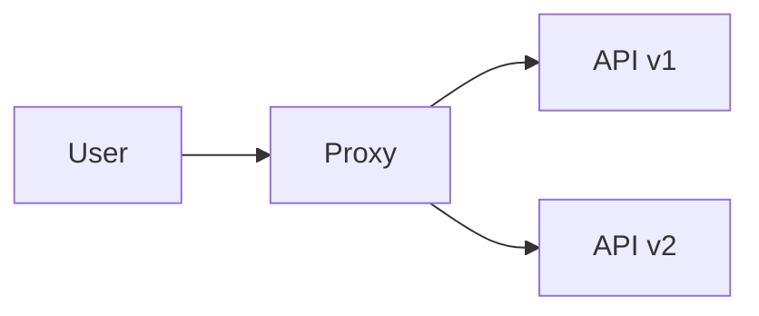

# 데모 문서

실제 Proxy에 합성 요청을 보내 v1·v2 전환과 응답 분배를 확인하는 로컬 검증 환경입니다. User는 HTTP 응답을 집계하고, 별도 검증 도구는 shadow·이벤트 저장과 분배 통과 여부를 확인합니다.

## 역할과 기능별 안내

| 문서 | 내용 |
| --- | --- |
| [User 호출](user/README.md) | 요청 옵션, 응답 버전·오류·지연 집계, 결과 해석 |
| [합성 API](backends/README.md) | 공통 요청 경로, v1 평면 응답·v2 공통 응답 구조, 동일 데이터 대조군 |
| [Proxy 전환](proxy/README.md) | serving 비율, shadow 설정, 설정 적용·복귀 절차 |
| [Docker 실행](runtime/README.md) | 서비스·이미지, 포트·설정 파일, 이벤트 볼륨 |
| [로컬 검증](validation/README.md) | 코드 검사, HTTP 통합 테스트, 이벤트 저장 smoke |
| [응답 분배 검증](validation/distribution.md) | 1,000회 요청, 허용 범위, 실패 조건·산출물 |
| [GitHub Actions](validation/github-actions.md) | 실행 조건, 수동 입력, 결과 요약·artifact |

모든 명령 예시는 프로젝트 루트 기준입니다. 처음 실행할 때는 [빠른 실행 안내](../../README-DEMO.md)를 참고합니다. [데모 구성·선택 설정](../README.md)을 확인한 뒤, 필요한 상세 문서를 위 표에서 찾아볼 수 있습니다.

## 문서와 구현의 경계

- 상세 데모 설명: `.demo/docs/`에 역할·기능별 배치.
- 데모 구현: `.demo/user/`, `.demo/v1/`, `.demo/v2/` 및 공통 `backend.py`에서 관리.
- Proxy: 제품의 실제 패키지와 실행 이미지 사용. 데모 전용 Proxy 구현 없음.
- User: Proxy 내부 상태·DB에 접근하지 않는 외부 호출자.
- 내부 이벤트 저장 확인: 읽기 전용 SQLite 접근을 사용하는 별도 smoke의 책임.
- 결과 파일: `.demo/results/`에 생성하며 Git 제외.
- 검증 범위: 합성 HTTP 요청과 로컬 컨테이너 동작. 실제 HTTPS·인증·업무 데이터·운영 부하·클라우드·다중 Proxy 검증 제외.
