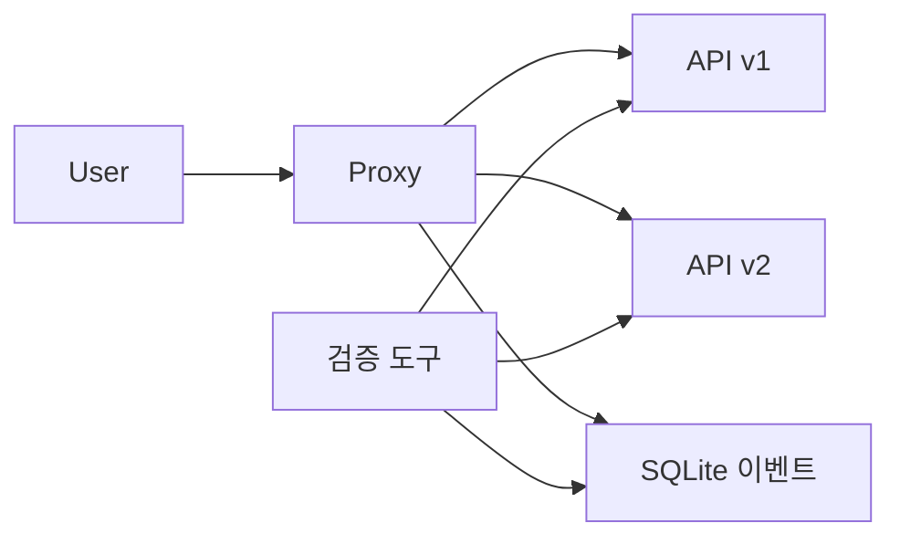

# 데모 문서

- 실제 Proxy에 합성 요청을 보내 v1·v2 전환과 shadow ON/OFF를 확인하는 로컬 검증 환경.
- 기본 실행은 v1 serving 100%, shadow OFF. `.env` 작성 없이 시작 가능.
- User 응답·backend 요청 수·정상 종료 후 SQLite 이벤트를 단계별로 대조.

## 역할과 기능별 안내

| 문서 | 내용 |
| --- | --- |
| [User 호출](user/README.md) | 요청 옵션, 응답 버전·오류·지연 집계, 결과 해석 |
| [합성 API](backends/README.md) | 공통 경로, 버전별 본문, 동일 데이터 대조군 |
| [Proxy 전환·관측](proxy/README.md) | serving·shadow 설정, 재생성, 내부 health·검증 기준 |
| [Proxy CLI](runtime/proxy-cli.md) | 호스트 실행 기본값·진단·설정 식별자 한계 |
| [관측 구현](runtime/observation.md) | 내부 계측·backend 요청 수·SQLite 저장·접근 경계 |
| [Docker 실행](runtime/README.md) | `.env` 기본값, 서비스·포트, JSON 설정·이벤트 volume |
| [개별 기능 검증](validation/README.md) | 코드 검사, HTTP 기능 테스트, 선택 smoke |
| [순차 시나리오](validation/scenarios.md) | serving 전환·복귀, shadow ON/OFF, 관측·이벤트 판정 |
| [선택 분배 검증](validation/distribution.md) | 한 비율의 단일 표본 검사, 허용 범위·산출물 |
| [GitHub Actions](validation/github-actions.md) | 기능 테스트 후 순차 시나리오, 수동 입력·artifact |

- 모든 명령 예시는 프로젝트 루트 기준. [빠른 실행 안내](../../README-DEMO.md), [데모 구성](../README.md) 참고.

## 문서와 구현의 경계

- 데모 구현·설정·문서: `.demo/`에서 관리. Proxy는 제품 패키지와 실행 이미지 사용.
- `tests/`: 개별 기능 테스트만 수집. 전체 시나리오를 pytest에서 중복 실행하지 않음.
- `scenarios/`: Docker 실행·설정 전환·관측·판정·정리를 담당하는 실행 도구.
- User: 외부 HTTP 응답만 집계. health·backend 요청 수·DB 조회는 시나리오 도구의 책임.
- Proxy health: 컨테이너 내부 loopback에서 `/healthcheck`만 조회. 메트릭·상태 HTTP API 없음.
- SQLite 조회: 읽기 전용 연결 사용. 선택 smoke는 이벤트 volume도 읽기 전용으로 mount.
- 결과 파일: `.demo/results/`에 생성하며 Git 제외. 토큰·요청 및 응답 본문 등 비밀값을 산출물에 저장하지 않음.
- 검증 범위: 합성 HTTP 요청과 로컬 컨테이너 동작. 실제 HTTPS·업무 인증·업무 데이터·운영 부하·클라우드·다중 Proxy 검증 제외.
