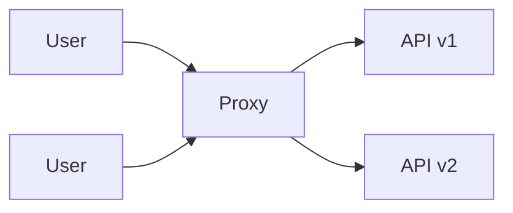

# api-migration-proxy

- API 리팩토링·마이그레이션을 위한 전환 프록시
- 경로별 설정과 전환 비율에 따라 사용자 요청을 v1 또는 v2로 전달
- 섀도잉·응답 비교·이벤트 기록·메트릭 수집으로 전환 검증 보조

```mermaid
flowchart LR
    User1[User] --> Proxy[Proxy]
    User2[User] --> Proxy
    Proxy --> V1[API v1]
    Proxy --> V2[API v2]
```
