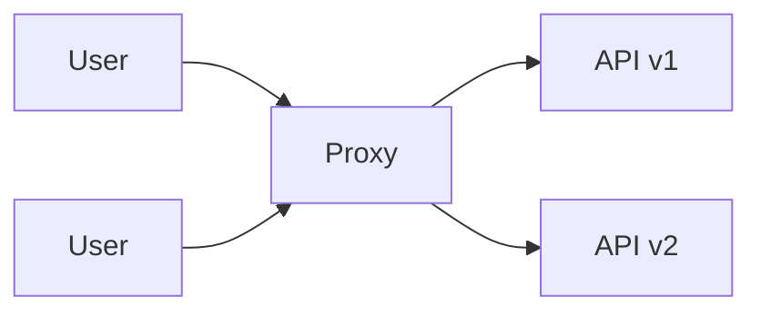

# api-migration-proxy

- API 리팩토링·마이그레이션을 위한 전환 프록시
- 경로별 설정과 전환 비율에 따라 사용자 요청을 v1 또는 v2로 전달
- 섀도잉·응답 비교·이벤트 기록·내부 메트릭 집계로 전환 검증 보조

관측 처리는 프록시 내부에서 수행합니다. 메트릭·상태 HTTP 조회 기능과 외부 관측 전송 SDK는 제공하지 않습니다. 이벤트는 로컬 SQLite 또는 설정한 사설 PostgreSQL에 저장합니다.

애플리케이션 배포 설정과 실행 방법은 [배포 안내](deploy/README.md)를 참고하십시오.
