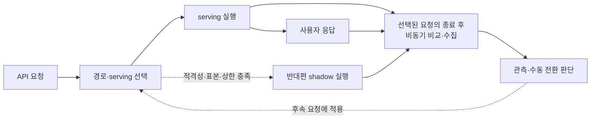

# API Migration Proxy 기획

제품과 기능의 책임별 기획, 공통 기준과 기술 자료를 정리한다.

사용자 응답은 미리 선택한 serving에서 반환하고, 조건을 충족한 요청만 반대편 shadow도 실행한다. 비교·수집 결과와 운영 지표를 근거로 v2 전환 비율을 조정한다.

| 영역 | 요약 |
| --- | --- |
| [제품](product/README.md) | 제품 목적·적용 범위·사용자 흐름·요구사항과 위험을 정의한다. |
| [요청 라우팅](routing/README.md) | 대상 API를 식별하고 사용자 응답 backend를 선택하며 HTTP 계약과 설정 일관성을 유지한다. |
| [Shadow 실행](shadow/README.md) | 복제 가능한 요청을 선택해 반대편 API도 실행하고 사용자 응답과 수명·자원을 분리한다. |
| [응답 비교](comparison/README.md) | 양쪽 실행 결과의 비교 가능 조건과 정상·차이·실패·한계를 판정한다. |
| [데이터 수집](collection/README.md) | 비교 이벤트를 제한된 방식으로 적재하고 상세 표본·조회·보존을 관리한다. |
| [관측](observability/README.md) | 사용자·backend·비교·수집 지표를 분리하고 누락을 포함한 운영 판단 근거를 제공한다. |
| [전환 관리](rollout/README.md) | 관측 증거를 바탕으로 비율을 확대하고 문제 발생 시 중지·복귀하며 최종 종료를 관리한다. |
| [인프라](infrastructure/README.md) | 실행 구성·스택 선택 조건과 자원·비용 예산을 정의한다. |
| [검증 계획](validation/README.md) | 기능별 요구사항을 검증 시나리오·부하 시험·완료 증거로 연결한다. |
| [공통 기준](_rules/README.md) | 여러 기능이 함께 사용하는 용어·권한·데이터 책임과 기술 검증 기준을 정의한다. |
| [기술 자료](research/README.md) | 마이그레이션 사례·설계 패턴·도구·서비스의 기능과 적용 한계를 비교한다. |
| [구현 작업](../todo/README.md) | 현행 기획의 구현·검증·전환·종료 순서와 완료 조건을 관리한다. |
