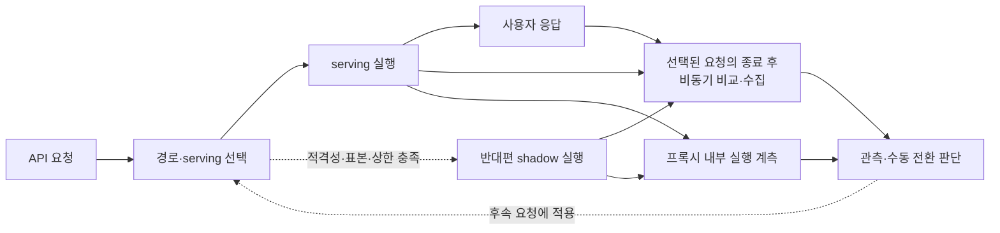

# API Migration Proxy 기획

이 디렉터리는 API Migration Proxy의 제품 요구사항, 기능별 처리 계약, 적용 절차와 판단 기준을 정의한다. 문서에 정의된 요구사항과 현재 구현의 대응 관계는 [구현 구성](implementation/README.md)에서 확인한다.

프록시는 backend 요청을 실행하기 전에 사용자 응답을 제공할 serving을 선택한다. Shadow 적격성, 표본 선택과 자원 상한을 모두 충족한 요청에 대해서만 반대편 backend도 실행한다. 마이그레이션 담당자는 비교·수집 결과와 운영 지표를 확인한 뒤 v2의 serving 비율 변경 여부를 판단한다.

계측·비교·데이터 보호는 프록시 내부에서 수행해야 한다. 내부 snapshot과 상태 조회는 유지하며, 메트릭·상세 상태를 내보내는 HTTP endpoint와 활성화 설정은 제공하지 않는다. 외부 수집기나 SaaS는 내부 처리를 위한 필수 구성 요소가 아니다.

상태 확인은 별도 loopback listener의 `GET /healthcheck` 하나만 제공한다. 실제 접속 peer도 loopback인지 확인해야 한다. 요청 수락 준비 상태이면 200, 준비되지 않았으면 503과 최소 본문을 반환한다. 이전 health 경로의 alias나 외부 접속을 허용하는 token 예외는 제공하지 않는다. 사용자 API 전달 포트는 별도로 유지하고 인터넷에 직접 공개하지 않는 배포 구성을 사용해야 한다.

## 문서의 적용 기준

- 기능 문서의 `해야 한다`는 요구사항을 뜻한다. 해당 문장을 실제 환경에서 검증했다는 뜻으로 해석해서는 안 된다.
- Python/FastAPI는 현재 구현 스택이다. 이벤트 저장은 로컬 SQLite를 기본으로 하며, 운영 조건에 따라 사설 PostgreSQL을 선택할 수 있다. 실행 인프라와 외부 관측 플랫폼은 아직 선정하지 않았다. 특정 운영 환경의 채택·검증 여부는 별도로 확인해야 한다.
- 현재 메트릭은 프로세스 메모리에 있으므로 재시작하면 초기화된다. SQLite의 선택된 shadow 비교 이벤트는 전체 메트릭 집계가 아니며, 저장 이벤트만으로 전체 요청의 분모를 복원해서는 안 된다.
- 운영 임계값과 예시 수치를 구분한다. 대상 API별로 값을 정하도록 명시한 항목은 설명용 예시를 사용하여 충족 여부를 판단해서는 안 된다.
- 문장의 의무 수준, 미확인의 처리와 절차 표기는 [공통 작성 기준](_rules/README.md#문장의-의미와-작성-기준)을 따른다. 기능 문서에 정의한 조건을 다른 기능의 완료 조건으로 대신 사용해서는 안 된다.

## 전체 처리 관계

```mermaid
flowchart LR
    A["API 요청"] --> B["경로·serving 선택"]
    B --> C["serving 실행"] --> D["사용자 응답"]
    B -. "적격성·표본·상한 충족" .-> E["반대편 shadow 실행"]
    C --> F["선택된 요청의 종료 후<br/>비동기 비교·수집"]
    D --> F
    E --> F
    F --> G["관측·수동 전환 판단"]
    C --> H["프록시 내부 실행 계측"]
    E --> H
    H --> G
    G -. "후속 요청에 적용" .-> B
```

## 기능별 문서

| 영역 | 요약 |
| --- | --- |
| [제품](product/README.md) | 제품 목적·적용 범위·사용자 흐름·요구사항과 위험을 정의한다. |
| [요청 라우팅](routing/README.md) | 대상 API를 식별하고 사용자 응답 backend를 선택하며 HTTP 계약과 설정 일관성을 유지한다. |
| [Shadow 실행](shadow/README.md) | 복제 가능한 요청을 선택해 반대편 API도 실행하고 사용자 응답과 수명·자원을 분리한다. |
| [응답 비교](comparison/README.md) | 양쪽 실행 결과의 비교 가능 조건과 정상·차이·실패·한계를 판정한다. |
| [데이터 수집](collection/README.md) | 비교 이벤트를 제한된 방식으로 적재하고 상세 표본·조회·보존을 관리한다. |
| [관측](observability/README.md) | 사용자·backend·비교·수집 지표를 분리하고 누락을 포함한 운영 판단 근거를 제공한다. |
| [전환 관리](rollout/README.md) | 관측 증거를 바탕으로 비율을 확대하고 문제 발생 시 중지·복귀하며 최종 종료를 관리한다. |
| [인프라](infrastructure/README.md) | 실행 구성·스택 선택 조건과 자원·비용 예산을 정의한다. |
| [검증 기준](validation/README.md) | 기능별 수용 조건·회귀 시나리오·부하 시험·증거 기준을 정의한다. |
| [공통 기준](_rules/README.md) | 여러 기능이 함께 사용하는 용어·권한·데이터 책임과 기술 검증 기준을 정의한다. |
| [기술 자료](research/README.md) | 마이그레이션 사례·설계 패턴·도구·서비스의 기능과 적용 한계를 비교한다. |
| [구현 구성](implementation/README.md) | 현재 구현된 구성 요소와 담당 기능·계약을 연결한다. |
