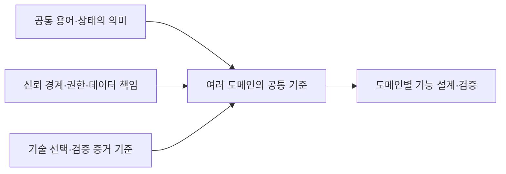

# 공통 기준

여러 기능이 함께 사용하는 용어·권한·데이터 책임과 기술 평가 기준을 정의한다. 각 기능의 설정·비교·수집·전환 규칙은 담당 기능 문서에서 관리한다.

| 문서 | 요약 |
| --- | --- |
| [공통 용어](glossary.md) | 버전·역할·요청·이벤트·revision·전환 상태의 의미 |
| [권한·데이터 책임](identity-and-data-boundaries.md) | 신뢰 경계, 인증·본문 보호, 동기화·외부 효과·복구의 책임 |
| [기술 평가 기준](technology-evaluation.md) | 자료의 적용 범위, 기술 선택과 검증 증거의 구분 |

[전체 문서](../README.md)
