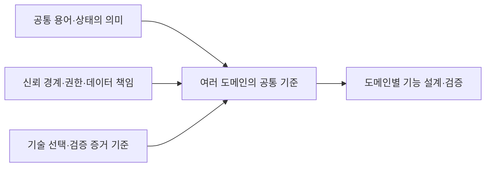

# 공통 기준

이 문서는 여러 기능이 함께 사용하는 용어, 권한, 데이터 책임과 기술 평가 기준의 적용 방법을 정의한다. 각 기능의 설정값과 처리 규칙은 해당 기능 문서에서 정의한다. 다른 기능 문서가 같은 용어를 사용할 때에는 이 디렉터리의 정의를 따른다.

```mermaid
flowchart LR
    A["공통 용어·상태의 의미"] --> D["여러 도메인의 공통 기준"]
    B["신뢰 경계·권한·데이터 책임"] --> D
    C["기술 선택·검증 증거 기준"] --> D
    D --> E["도메인별 기능 설계·검증"]
```

| 문서 | 요약 |
| --- | --- |
| [공통 용어](glossary.md) | 버전·역할·요청·이벤트·revision·전환 상태의 의미 |
| [권한·데이터 책임](identity-and-data-boundaries.md) | 신뢰 경계, 인증·본문 보호, 동기화·외부 효과·복구의 책임 |
| [기술 평가 기준](technology-evaluation.md) | 자료의 적용 범위, 기술 선택과 검증 증거의 구분 |

## 문장의 의미와 작성 기준

이 디렉터리는 [ASD-STE100 Issue 9](https://www.asd-ste100.org/assets/files/ASD-STE100_ISSUE9.pdf)의 용어·문장·절차 원칙을 한국어 기술 문서에 적용한다. 영어 승인 어휘와 영어 문법의 준수율을 산출하지 않는다. 한국어 문장은 아래 기준으로 검토한다.

| 표현 | 의미 | 작성할 때 포함할 내용 |
| --- | --- | --- |
| `한다` | 제품의 동작, 용어의 정의 또는 문서에서 채택한 기준을 설명한다. | 동작의 주체, 대상과 적용 조건을 명시한다. 현재 구현을 설명할 때에는 구현된 범위까지 명시한다. |
| `하십시오` | 담당자가 실행할 절차의 지시이다. | 절차 앞에 담당자를 명시한다. 각 단계에서 수행할 동작과 대상을 명시한다. |
| `하지 마십시오` | 담당자가 절차 중 수행해서는 안 되는 동작이다. | 금지 조건과 대상을 명시한다. 실행할 수 있는 후속 조치가 정해져 있으면 그 조치도 명시한다. |
| `해야 한다` | 해당 기능 또는 절차를 적용할 때 충족해야 하는 요구사항이다. | 충족 여부를 판단할 조건과 확인할 결과를 명시한다. 요구사항의 존재만으로 실제 환경에서 충족된 것으로 표시해서는 안 된다. |
| `해서는 안 된다` | 해당 조건에서 허용하지 않는 행위이다. | 금지하는 행위와 적용 범위를 명시한다. |
| `권장한다` | 채택 여부를 결정할 수 있는 권고이다. | 권고의 적용 조건과 이유를 명시한다. 권고를 필수 수용 조건으로 사용해서는 안 된다. |
| `미정` | 문서 또는 해당 대상 API에서 아직 결정하지 않은 항목이다. | 결정할 값이나 계약, 결정에 필요한 정보와 그 값이 필요한 절차를 명시한다. 예시를 미정 항목의 기본값으로 사용해서는 안 된다. |
| `미확인` | 판단에 필요한 사실이나 결과를 확인하지 못한 상태이다. | 확인하지 못한 대상과 부족한 증거를 명시한다. 성공, 실패 또는 값 `0`으로 바꾸어 기록해서는 안 된다. |

문장 하나에는 주된 행위 또는 개념 하나를 작성한다. 조건, 행위와 결과가 다른 경우에는 문장을 나눈다. 용어 목록과 표의 열 이름은 짧은 명사형으로 작성할 수 있다.

| 문장·문단 기준 | 적용 방법 |
| --- | --- |
| 같은 대상에 같은 이름을 사용한다. | [공통 용어](glossary.md)의 이름을 사용한다. 동의어를 번갈아 사용하거나 한 용어에 다른 의미를 부여하지 않는다. |
| 주체가 동작을 수행하는 문장을 쓴다. | 주체가 바뀌면 주체를 다시 적는다. 사람이 실행할 지시와 시스템의 자동 처리를 구분한다. |
| 조건을 동작보다 먼저 제시한다. | 실행 전에 알아야 할 조건으로 문장을 시작한다. 조건이 충족되지 않은 경우와 미확인인 경우를 구분한다. |
| 한 문장에 하나의 지시를 쓴다. | 순서가 다른 행동은 별도 단계로 나눈다. 여러 조건을 함께 확인해야 하면 조건을 목록이나 표로 제시한다. |
| 문장을 짧고 직접적으로 쓴다. | 한국어의 자연스러운 어순으로 주체와 동작을 명시한다. 여러 판단이나 행동이 섞여 이해하기 어려우면 문장을 나눈다. |
| 한 문단에 하나의 주제를 쓴다. | 첫 문장에서 주제를 밝힌다. 주제가 바뀌거나 조건과 결과의 관계를 따라가기 어려우면 문단을 나눈다. |
| 지시를 설명 속에 숨기지 않는다. | 참고 설명에는 배경과 이유를 적는다. 수행해야 할 동작은 절차에 적는다. |
| 문장 부호로 조건을 대신하지 않는다. | 본문에서 세미콜론으로 문장을 연결하지 않는다. `/`와 `·`로 필수 조건의 결합 방식을 표시하지 않는다. |

영어 승인 어휘나 단어 수 제한을 한국어 문장에 그대로 적용하지 않는다. 문장 길이보다 기술적 정확성과 자연스러운 표현을 우선한다. 코드, 식별자, 수식, 외부 자료의 정식 제목은 정확한 표기를 유지한다. 길이를 줄이기 위해 계약의 조건이나 제한을 삭제해서는 안 된다.

다음 기준을 모든 기능 문서에 적용한다.

- 모든 조건의 충족과 하나 이상의 조건 충족을 명확히 구분한다. `모두`, `하나라도`와 같은 표현을 사용할 수 있다. `등`으로 필수 조건의 범위를 생략해서는 안 된다.
- 비교 대상, 시간 구간, 단위와 분모를 명시한다. `정상`, `충분`, `적절`, `최신`만으로 통과 조건을 정의해서는 안 된다.
- 설정한 값, 실행 중인 worker에 적용된 값, 실행 결과와 저장 결과를 각각 구분한다. 설정 제출이나 저장 요청만으로 적용 또는 저장 완료를 표시해서는 안 된다.
- 제품 요구사항, 현재 구현, 외부 제품의 기능과 실제 운영 검증 결과를 구분한다. 어느 하나의 설명을 다른 항목의 완료 증거로 사용해서는 안 된다.
- 기존 계약에 없는 수치, 자동 처리, 승인 단계 또는 완료 보장을 문장 보완을 이유로 추가해서는 안 된다.

## 절차의 작성과 판독 기준

순서가 결과에 영향을 주는 작업은 번호가 있는 절차로 작성한다. 독립적인 조건 목록과 비교표에는 수행 순서가 있는 것처럼 번호를 붙이지 않는다.

| 절차의 구성 | 명시할 내용 |
| --- | --- |
| 적용 범위·담당자 | 어떤 route, 설정 변경 또는 관측 구간에 적용하는지와 누가 수행하는지를 명시한다. 역할의 의미는 [제품의 사용자와 책임](../product/overview.md#사용자와-책임)을 따른다. |
| 시작 조건·입력 | 작업 전에 충족해야 하는 조건과 사용할 설정·증거를 명시한다. |
| 수행 단계 | 단계마다 수행할 행위와 확인할 결과를 적는다. 선행 단계가 필요한지, 독립적으로 또는 병렬로 수행할 수 있는지를 명시한다. |
| 조건 분기 | 조건이 충족된 경우, 충족되지 않은 경우와 확인할 수 없는 경우의 다음 동작을 구분한다. 모든 절차에 세 분기가 필요한 것은 아니지만, 미확인을 성공으로 취급해서는 안 된다. |
| 완료 조건 | 무엇을 확인해야 해당 작업이 끝나는지 명시한다. 요청 실행 완료, 비교 완료, 저장 확인, 전환 완료와 데이터 복구 완료를 서로 대체해서는 안 된다. |

기능 문서의 완료 조건은 해당 기능의 범위에만 적용한다. 예를 들어 serving 비율 변경의 완료 조건을 충족해도 데이터 복구나 프록시 제거가 완료된 것은 아니다. 다른 작업의 완료가 필요한 경우에는 해당 작업의 문서와 조건을 연결한다.

[전체 문서](../README.md)
