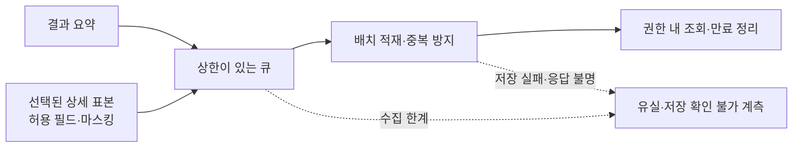

# 데이터 수집

비교 이벤트를 제한된 방식으로 적재하고 상세 표본·조회·보존을 관리한다.

결과 요약을 기본으로 수집하고, 상세 데이터는 허용된 필드와 표본에 한해 마스킹한다. 적재 실패와 저장 확인 불가를 구분하며, 수집 경로가 사용자 응답을 지연시키지 않도록 상한을 둔다.

## 기능별 문서

| 기능 | 상세 범위 |
| --- | --- |
| [이벤트 모델](event-model.md) | 양쪽 결과 요약과 전환 이력의 논리 필드 |
| [비동기 적재](async-storage.md) | 큐, 배치, 중복 방지와 유실 처리 |
| [상세 표본·마스킹](detail-sampling.md) | 표본율·허용 필드·상한과 민감 값 제거 |
| [조회·보존](query-and-retention.md) | 사례 검색, 조회 제한과 만료 정리 |

[전체 도메인](../README.md)
