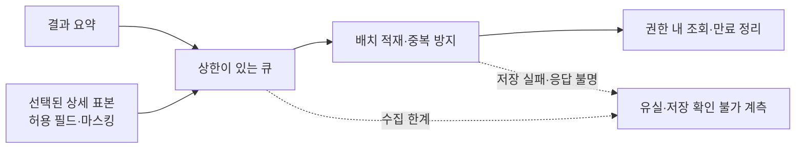

# 데이터 수집

데이터 수집은 [비교 이벤트](../_rules/glossary.md)의 요약과 허용된 상세 표본을 저장한다. 데이터 수집 기능은 조회 범위와 보존 기간도 관리한다. 비교용으로 메모리에 캡처한 응답 본문 전체가 저장 대상이 되는 것은 아니다.

결과 요약을 기본 수집 대상으로 사용한다. 상세 데이터는 별도의 표본 선택과 필드 허용·마스킹 조건을 통과한 경우에만 저장 대상으로 만든다. 프록시는 비교·마스킹·저장을 사용자 응답 전달과 분리한다. 각 작업에는 수량·크기·시간 상한을 적용한다.

프록시는 메트릭을 내부에서 집계하고, 비교 이벤트를 내부 저장소에 보관한다. 외부 수집기나 공개 조회 endpoint는 기본 처리의 전제 조건이 아니다. 운영자가 외부 전송을 별도로 허용하기 전에는 이벤트와 원본 API 데이터를 외부 서비스로 보내지 않아야 한다.

## 데이터별 책임

| 데이터 | 내부 처리와 보관 기준 |
| --- | --- |
| 집계 메트릭 | 요청·실행·비교 단계에서 수량과 지연을 프로세스 내부 메모리에 집계한다. 비교 이벤트와 분리하고, 집계 구간, 프로세스 세대 및 관측 완전성을 함께 해석한다. |
| 비교 이벤트 | Shadow 표본으로 선택한 요청의 안전한 요약을 보관한다. 상세는 기본 비활성이며, 허용 필드·마스킹·표본율·크기·보존 정책을 정한 경우에만 보관한다. |
| 전환 이력 | 설정이나 stage를 변경한 사실과 근거를 기록한다. 비교 표본의 드롭 정책을 전환 이력에 자동 적용하지 않는다. |

비교 이벤트의 행 수로 전체 요청 수나 전체 성공률을 복원해서는 안 된다. 상세 표본만으로 전체 불일치율을 계산해서도 안 된다. 전체 처리의 분모는 [집계 메트릭과 커버리지](../observability/coverage-and-analysis.md)에서 얻는다.

## 기본 저장소와 운영 선택

| 구성 | 선택 조건과 데이터 경계 |
| --- | --- |
| 로컬 SQLite | 단일 호스트에서 하나의 writer가 기록하는 기본 구성이다. DB 파일과 데이터 디렉터리는 실행 계정의 접근 범위 안에 두어야 한다. |
| 사설 PostgreSQL | 여러 호스트가 같은 저장소를 사용하거나, 쓰기 경합 때문에 SQLite로 처리 예산을 충족할 수 없을 때 선택한다. 운영자가 승인한 사설 DB로만 연결해야 한다. |

사설 PostgreSQL을 사용하면 데이터가 프록시 호스트에서 DB 호스트로 이동한다. 허용된 전송 필드, 연결 암호화, 계정 권한 및 보존 책임을 먼저 정해야 한다. 사설 DB의 사용은 외부 SaaS로 데이터를 보내는 설정과 구분한다. 저장소가 바뀌어도 원본 body·인증 정보·예외 원문을 수집 대상으로 추가해서는 안 된다.

SQLite와 PostgreSQL에는 같은 [저장 ACK 계약](async-storage.md)과 [조회·보존 계약](query-and-retention.md)을 적용한다. 기본 CLI의 주기적 만료 정리와 새 SQLite 파일·디렉터리의 제한된 권한도 제품 요구사항에 포함한다. 이 요구사항의 실제 구현·연결 여부는 [구현 구성](../implementation/README.md)에서 확인한다.

## 저장 결과의 해석

큐에 넣은 사실과 저장을 확인한 사실은 구분해야 한다. 저장소의 성공 확인을 받지 못했어도 이벤트가 실제로 저장되었을 수 있다. 성공 확인이 없다는 이유만으로 확정 유실로 단정해서는 안 된다. 조회할 때에는 저장 확인 여부와 별도로 조회 권한, 요약·상세 만료 여부 및 조회 상한을 적용한다.

다음 도식은 저장할 요약과 상세가 준비된 이후의 적재 경로를 나타낸다. 비교 작업의 선행 큐와 전체 처리 순서는 [비동기 적재](async-storage.md)에서 정의한다.

```mermaid
flowchart LR
    A["결과 요약"] --> C["상한이 있는 큐"]
    B["선택된 상세 표본<br/>허용 필드·마스킹"] --> C
    C --> D["배치 적재·중복 방지"]
    D --> E["권한 내 조회·만료 정리"]
    C -. "수집 한계" .-> F["유실·저장 확인 불가 계측"]
    D -. "저장 실패·응답 불명" .-> F
```

## 기능별 문서

| 기능 | 상세 범위 |
| --- | --- |
| [이벤트 모델](event-model.md) | 요청별 양쪽 결과 요약과 별도 전환 이력의 논리 필드를 정의한다. |
| [비동기 적재](async-storage.md) | 큐 제출, 배치 저장, 재시도, 중복 방지 및 유실·ACK 미확인을 구분한다. |
| [상세 표본·마스킹](detail-sampling.md) | 상세 표본 선택, 필드 허용, 크기 상한, 마스킹 및 상세 상태를 정의한다. |
| [조회·보존](query-and-retention.md) | 조회 조건·권한·상한과 만료 데이터의 조회 제외·삭제를 정의한다. |

[전체 도메인](../README.md)
