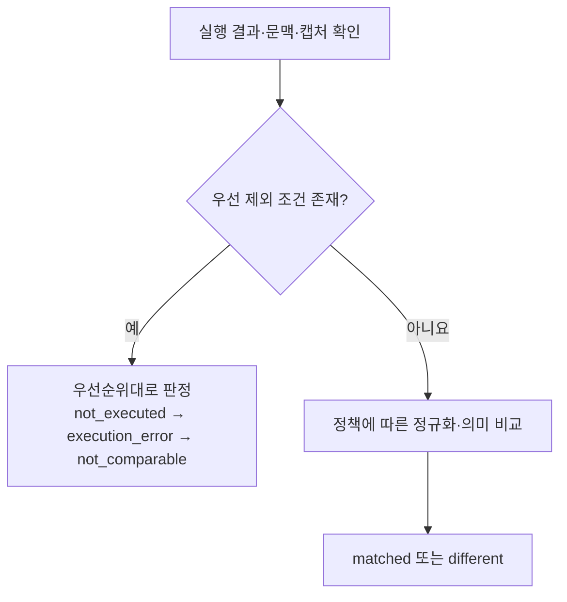

# 응답 비교

양쪽 실행 결과의 비교 가능 조건과 정상·차이·실패·한계를 판정한다.

미실행, 실행 오류, 비교 불가 조건을 먼저 확인하고, 비교 가능한 결과에만 정규화·의미 비교를 적용한다. 비교 처리는 사용자에게 전달하는 원본 응답을 변경하지 않는다.

## 기능별 문서

| 기능 | 상세 범위 |
| --- | --- |
| [문맥과 결과 판정](context-and-outcomes.md) | 데이터·권한 조건, backend 상태와 비교 결과 |
| [정규화와 의미 비교](normalization.md) | JSON·status·헤더, 제외·허용 오차와 예시 |

[전체 도메인](../README.md)
