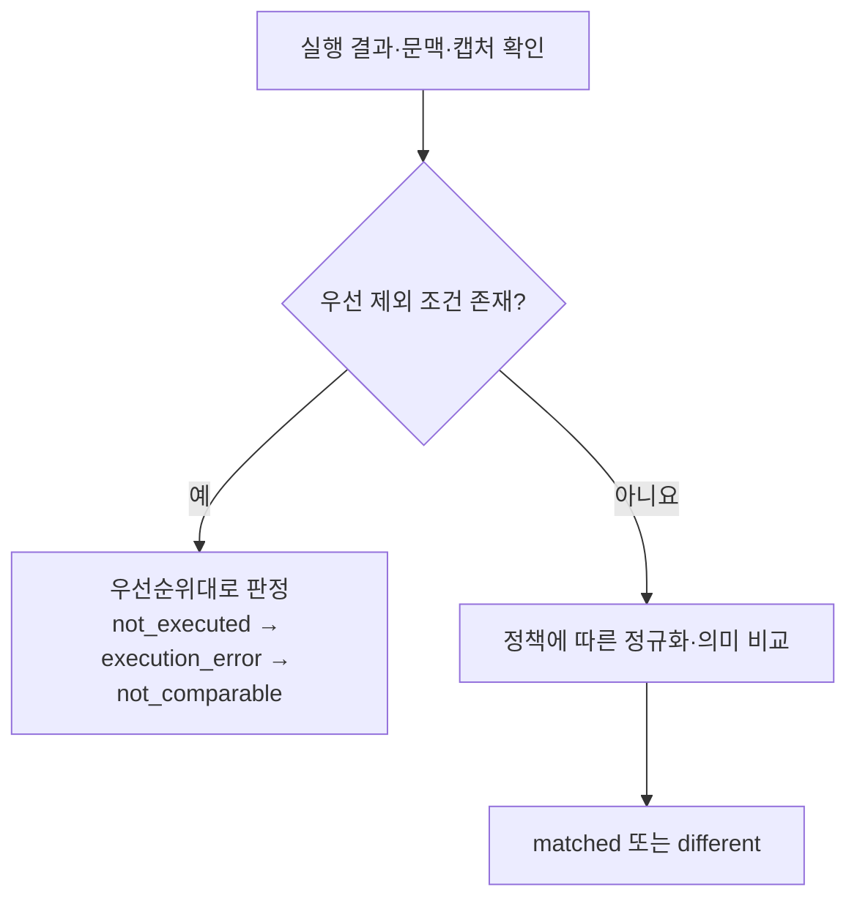

# 응답 비교

응답 비교는 같은 [논리 요청](../_rules/glossary.md)에 대한 v1과 v2의 실행 결과를 판정한다. 먼저 양쪽 결과를 비교할 수 있는지 확인한다. 비교할 수 있는 경우에만 등록된 정책에 따라 일치 여부를 판정한다.

비교기는 다음 순서로 판정한다. 앞 단계에서 최종 결과가 정해지면 뒤 단계의 일치 비교를 수행하지 않는다.

1. 선택된 shadow가 실제로 실행되었는지 확인한다.

   실행되지 않았으면 `not_executed`로 판정한다.

2. 실행된 backend에 timeout, 취소, 전송 오류 또는 예상 밖 API 오류가 있는지 확인한다.

   하나라도 있으면 `execution_error`로 판정한다.

3. 양쪽 응답이 비교 가능 조건을 모두 충족하는지 확인한다.

   조건은 계약 분류, 본문 캡처, 논리 입력·권한·데이터 문맥 및 파싱 조건이다.
   필요한 조건을 충족하지 못하거나 확인할 수 없으면 `not_comparable`로 판정한다.

4. 비교 가능한 응답에 정규화·의미 비교를 적용한다.

   등록 정책을 적용한 뒤 차이가 남으면 `different`로 판정한다.
   차이가 없으면 `matched`로 판정한다.

여기서 `matched`는 관측된 두 응답이 등록 정책에서 일치한다는 뜻이다. 전체 서비스의 정확성이나 전환 준비 완료를 뜻하지 않는다. 비교 처리는 사용자에게 전달하는 원본 응답을 변경하지 않는다.

```mermaid
flowchart TD
    A["실행 결과·문맥·캡처 확인"] --> B{"우선 제외 조건 존재?"}
    B -- "예" --> C["우선순위대로 판정<br/>not_executed → execution_error → not_comparable"]
    B -- "아니요" --> D["정책에 따른 정규화·의미 비교"]
    D --> E["matched 또는 different"]
```

## 기능별 문서

| 기능 | 상세 범위 |
| --- | --- |
| [문맥과 결과 판정](context-and-outcomes.md) | 비교의 선행 조건, backend별 상태, 최종 결과의 우선순위를 정의한다. |
| [정규화와 의미 비교](normalization.md) | JSON·status·헤더 비교, 필드 제외·허용 오차·매핑 및 차이 정보의 한계를 정의한다. |

[전체 도메인](../README.md)
