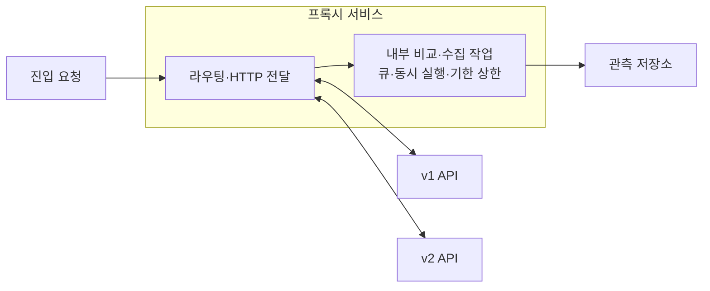

# 인프라

실행 구성·스택 선택 조건과 자원·비용 예산을 정의한다.

최소 구성은 프록시 서비스와 내부의 제한된 비교·수집 작업, 관측 저장소를 중심으로 검토한다. 아래는 논리 구성으로, 운영 인프라·저장소 제품이나 별도 worker 도입을 확정하지 않는다.

## 기능별 문서

| 기능 | 상세 범위 |
| --- | --- |
| [구성과 스택 선택](deployment-and-stack.md) | 최소 토폴로지와 AWS·FastAPI·PostgreSQL 후보 조건 |
| [용량·비용](capacity-and-cost.md) | 실행량 수식, 저장·공유 cache·의존 부하 |

## 공통 기준과 참고자료

| 문서 | 상세 범위 |
| --- | --- |
| [권한·데이터 경계](../_rules/identity-and-data-boundaries.md) | 신뢰 경계, 동기화와 쓰기·복구 책임 |
| [서비스·런타임 후보](../research/service-options-and-constraints.md) | AWS·Python HTTP·PostgreSQL의 기능과 적용 조건 |

[전체 도메인](../README.md)
