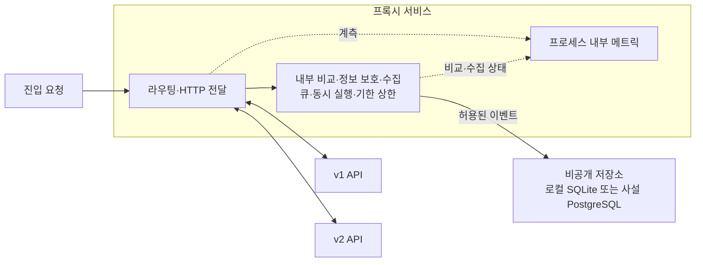

# 인프라

이 문서 모음은 Proxy의 논리 실행 구성, 저장소 선택 조건, 자원·비용 예산을 정의한다. 구현 스택은 Python/FastAPI이다. 내부 계측·비교·정보 보호·제한 큐를 기본 구성으로 삼는다. 운영 실행 인프라와 외부 관측 제품은 아직 선정하지 않았다.

관측 자료는 승인된 접근 경계 안에서 처리하고 저장한다. 단일 호스트에서는 로컬 SQLite를 사용할 수 있다. 여러 호스트의 쓰기나 쓰기 경합을 처리해야 하면 사설 PostgreSQL을 선택할 수 있다.

메트릭·상태를 조회하는 HTTP endpoint와 이를 활성화하는 설정은 제공하지 않는다. 내부 계측, snapshot과 상태 조회는 유지한다. Proxy 외부 수신 주체로의 관측 전송은 기본 구성에 포함하지 않는다. 여기서 외부 수신 주체는 조직 내부의 별도 관측 수집기도 포함한다. 선택한 이벤트 저장소에 기록하는 동작은 이 전송 기능과 구분한다. 이 계약의 현재 구현 범위는 [구현 구성](../implementation/README.md)에서 확인한다.

상태 확인은 별도 loopback listener의 `GET /healthcheck` 하나만 사용한다. 실제 접속 peer도 loopback인지 검증해야 한다. 요청 수락 준비 상태이면 200, 준비되지 않았으면 503과 최소 본문을 반환한다. 기존 health 경로의 alias나 외부 접속을 허용하는 token 예외는 제공하지 않는다. 사용자 API 전달 포트는 이 경로와 분리하고 인터넷에 직접 공개하지 않아야 한다.

아래 그림은 기본 처리와 데이터 흐름을 나타낸다. 프록시의 내부 계측과 이벤트 저장에는 별도 수집기, 외부 메시지 브로커 또는 SaaS가 필요하지 않다.

```mermaid
flowchart LR
    A["진입 요청"] --> B
    subgraph P["프록시 서비스"]
        B["라우팅·HTTP 전달"] --> C["내부 비교·정보 보호·수집<br/>큐·동시 실행·기한 상한"]
        B -. 계측 .-> M["프로세스 내부 메트릭"]
        C -. 비교·수집 상태 .-> M
    end
    B <--> D["v1 API"]
    B <--> E["v2 API"]
    C -->|허용된 이벤트| F["비공개 저장소<br/>로컬 SQLite 또는 사설 PostgreSQL"]
```

운영 담당자는 실제 대상 API의 HTTP 계약, 대표 부하, 가용성·복귀 요구를 근거로 실행 환경과 용량을 결정해야 한다. 구성 요소의 존재나 제품 후보의 기능 목록만으로 운영 요구가 충족되었다고 판단해서는 안 된다. serving과 shadow 등의 용어는 [공통 용어](../_rules/glossary.md)를 따른다.

이벤트를 영속 저장하는 기능과 여러 인스턴스의 메트릭을 합산하는 기능은 별도 책임이다. 저장소를 공유해도 각 프로세스의 메트릭과 설정 revision이 자동으로 통합되지는 않는다. 외부 연동을 별도로 검토할 때에는 목적, 허용 필드, 수신 주체와 접근 권한을 먼저 정해야 한다. 이 검토가 제품의 관측 HTTP endpoint를 제공한다는 뜻은 아니다.

## 기능별 문서

| 기능 | 상세 범위 |
| --- | --- |
| [구성과 스택 선택](deployment-and-stack.md) | 내부 처리, SQLite·PostgreSQL 선택, 단일 healthcheck와 비공개 배포 조건을 정의한다. |
| [용량·비용](capacity-and-cost.md) | 실행량과 저장량을 추정하는 수식, 공유 cache·의존 자원의 영향, 실측 증거의 조건을 정의한다. |

## 공통 기준과 참고자료

| 문서 | 상세 범위 |
| --- | --- |
| [권한·데이터 경계](../_rules/identity-and-data-boundaries.md) | 신뢰 경계와 데이터 동기화·쓰기·복구의 책임을 정의한다. |
| [서비스·런타임 후보](../research/service-options-and-constraints.md) | AWS, Python HTTP 실행 구성, PostgreSQL의 기능과 적용 조건을 설명한다. |

[전체 도메인](../README.md)
