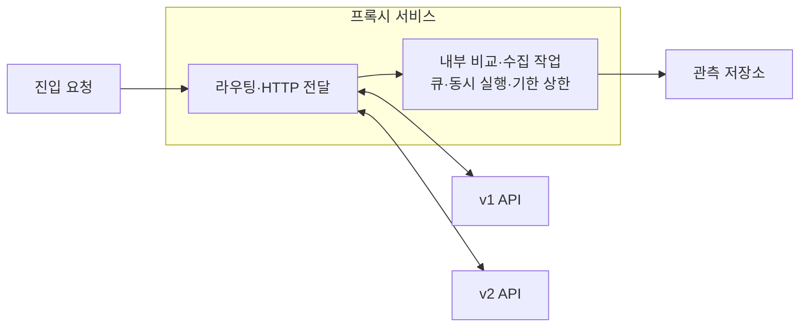

# 인프라

Proxy의 실행 구성·스택 선택 조건과 자원·비용 예산을 정의한다. Python/FastAPI 기반 Proxy는 전용 Docker 이미지로 로컬 동작을 확인하며, Terraform과 클라우드 배포 시나리오는 보류한다.

최소 구성은 프록시 서비스와 내부의 제한된 비교·수집 작업, 관측 저장소를 중심으로 검토한다. 아래는 논리 구성으로, 운영 인프라·저장소 제품이나 별도 worker 도입을 확정하지 않는다.

```mermaid
flowchart LR
    A["진입 요청"] --> B
    subgraph P["프록시 서비스"]
        B["라우팅·HTTP 전달"] --> C["내부 비교·수집 작업<br/>큐·동시 실행·기한 상한"]
    end
    B <--> D["v1 API"]
    B <--> E["v2 API"]
    C --> F["관측 저장소"]
```

## 기능별 문서

| 기능 | 상세 범위 |
| --- | --- |
| [구성과 스택 선택](deployment-and-stack.md) | Proxy 실행·설정·저장 경계와 운영 스택 검토 조건 |
| [용량·비용](capacity-and-cost.md) | 실행량 수식, 저장·공유 cache·의존 부하 |

## 공통 기준과 참고자료

| 문서 | 상세 범위 |
| --- | --- |
| [권한·데이터 경계](../_rules/identity-and-data-boundaries.md) | 신뢰 경계, 동기화와 쓰기·복구 책임 |
| [서비스·런타임 후보](../research/service-options-and-constraints.md) | AWS·Python HTTP·PostgreSQL의 기능과 적용 조건 |

[전체 도메인](../README.md)
