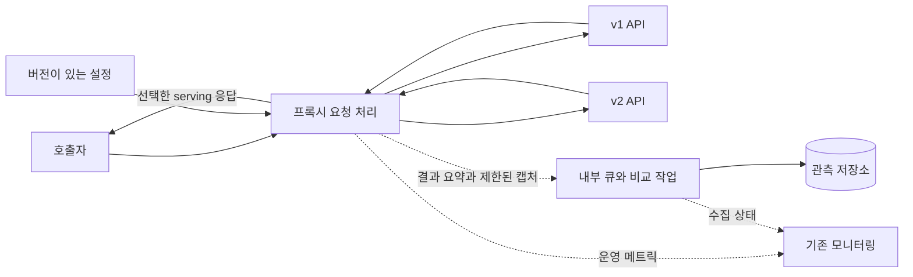

# 실행 구조와 기술 스택 선택

- 운영 조건에 맞춘 최소 논리 구성 배치
- 미정 기술 후보의 채택 기준 정의

## 기능 계약

| 항목 | 정의 |
| --- | --- |
| 시작 조건·입력 | 기존 진입·배포·모니터링 환경, HTTP·수명·가용성·복귀 요구와 대표 부하 |
| 결과·출력 | 실행 환경·프록시·저장소의 역할 배치와 후보 검증 결과 |
| 실패·제한 | AWS·FastAPI·PostgreSQL 미선정, 로컬 단일 프로세스 검증의 운영 가용성 보장 확대 금지 |

## 최소 논리 구성

- 초기 배치: 프록시 요청 처리·내부 큐·비교 작업을 같은 배포 서비스에 배치
- 논리 기능 구분과 별도 마이크로서비스·외부 브로커 도입의 구분
- 저장소의 용도: 관측용; 요청별 라우팅 판단의 동기 조회 제외

- 설정 조회·backend 호출·비교·저장의 프레임워크별 선행 추상 계층 제외
- 구현 언어 확정 후 계약을 만족하는 최소 구조 구현

## 인프라 결정 전제

- 기술 후보: AWS·FastAPI·PostgreSQL; 채택 미정
- 제품별 성능·요금·지원 버전의 비교·채택 증거는 별도 확보 필요
- 제품별 기능·수명 제약: [서비스·런타임 후보](../research/service-options-and-constraints.md)
- 기존 gateway 재사용·배정 담당·실행 환경 결정: [프록시 도구 비교](../research/proxy-patterns-and-tools.md)와 아래 책임·결정 조건을 대조

| 논리 구성 | 필요한 책임 | 후보와 결정 조건 |
| --- | --- | --- |
| 진입 경로 | 기존 호출자를 프록시 또는 기존 API로 연결 | 기존 로드밸런서·gateway·DNS 구성과 우회 요구부터 확인 |
| 프록시 실행 | HTTP 전달, 양쪽 실행, 캡처·비교·비동기 적재 | FastAPI 후보. 동시성·취소·body 전달·부하 검증 후 채택 |
| 관측 저장소 | 비교 요약·일부 상세·전환 이력 조회와 만료 | PostgreSQL 후보. 유입량·조회·보존·운영 여건 검증 |
| 메트릭·로그 | serving·backend·비교·수집 상태 수집 | 기존 모니터링을 우선 사용하고 새 플랫폼을 필수로 두지 않음 |
| 설정 배포 | revision 검증·적용·복구 | 기존 파일·배포 이력으로 시작 가능한지 검토 |
| 비밀·권한 | backend 인증과 저장소 접근 관리 | 현재 조직의 관리 방식을 따르며 설정에 credential 원문 저장 안 함 |

- 로컬 단일 프로세스 동작 검증과 운영 replica·장애 영역 결정의 구분
- 운영 가용성 검증 전 단일 인스턴스 충분성 확정 금지

## 기술 후보별 확인 사항

### AWS

- 기존 네트워크·리전·배포 도구와의 적합성 우선 확인
- 결정 기준: 프록시와 v1/v2 간 왕복 경로, 관측 저장소 접근, 장애 시 우회, 운영 비용
- 멀티 리전·Kubernetes·외부 메시지 브로커의 초기 필수 지정 제외

- 관리형 실행 환경 검증: 요청 제한 시간, 연결·body 처리, 정상 종료 유예, 응답 후 shadow 작업 수명, 네트워크·로그 비용
- 실제 제품·버전 기준 확인; 내부 백그라운드 작업 완료의 자동 보장 가정 금지

### FastAPI

- 후보 용도: 프록시 HTTP 진입점과 상태·설정 확인
- 함께 검증할 구성: HTTP 클라이언트와 서버 실행 모델
- 핵심 검증: 연결 재사용, 자동 redirect·retry, TLS·header 처리, 요청 body 복제, client 취소 전파

- 응답 후 task 시작 기능과 shadow 수명·종료·유실 보장의 구분
- JSON 비교·마스킹 CPU 부하의 요청 처리 영향 측정
- 필요 시 같은 서비스 안의 작업 실행 예산 분리
- 검증 전 특정 worker·thread·process 구성 고정 금지
- worker 프로세스마다 생성되는 실행 제한·HTTP/DB pool·내부 큐의 범위를 확인하고 인스턴스 전체 예산으로 합산

### PostgreSQL

- 후보 용도: 비교 이벤트·전환 이력의 제한된 저장·조회
- 핵심 조회 키: event ID, 기간·route·결과
- 모든 응답 필드의 선행 인덱스 생성 제외
- 배치 적재·만료 삭제의 동시 실행 검증

- DB 장애와 serving 경로의 분리, 재시도 이벤트의 중복 집계 방지
- partition·별도 분석 저장소 필요성: 적재량 실측 후 결정
- raw body 전량 저장·장기 보존의 선행 전제 제외

## 실행 상태와 종료 확인

| 확인 대상 | 필요한 계약 | 판단 경계 |
| --- | --- | --- |
| 프로세스 생존 | 요청 처리 프로세스의 생존 상태 확인 | backend 품질·cache warm 상태의 증거로 사용 금지 |
| 요청 수락 준비 | 최초 유효 설정·필수 실행 자원과 요청 수락 가능 상태 확인 | 관측 저장소 장애만으로 정상 serving 인스턴스를 일괄 제외하지 않도록 검증 |
| 전환 준비 | gate별 데이터·권한·대표 부하·복귀 증거 확인 | 프로세스 readiness와 별도 운영 판단 |
| 정상 종료 | 신규 수락 중지, serving·shadow·내부 큐의 제한된 배출 | 배출 제한 시간 초과·강제 종료의 유실 가능성 기록 |

- health endpoint·배포 도구의 구체 형식: 실행 환경 선택 후 기존 방식에 맞춰 결정
- 진입점의 등록 해제·요청 차단과 애플리케이션의 serving·응답 후 작업 배출을 각각 확인; HTTP 연결 배출 완료를 내부 작업 완료로 간주 금지
- 응답 후 작업의 유실 허용 범위와 종료 유예 시간: 수집 계약·복귀 목표·플랫폼 수명을 함께 검증

## 최소 운영 토폴로지의 결정 기준

- 필수 충족 항목: HTTP 계약, 응답 후 shadow 수명, 정상 종료, 관측 경로 장애 격리, 복귀 목표 시간, 대표 부하
- 검증 순서: 기존 도구로 운영 가능한 구성부터 시작
- 별도 worker·브로커·저장소 확장: 초기 단일 서비스·내부 큐의 성능·내구성·장애 격리 한계를 확인한 뒤 결정

## 검증 계획

- 구현 후 검증: [T-13, T-24, T-35, T-36, T-39](../validation/test-catalog.md)

## 관련 기능

- [품질 목표](../validation/quality-and-acceptance.md)
- [용량·비용 검증](capacity-and-cost.md)
