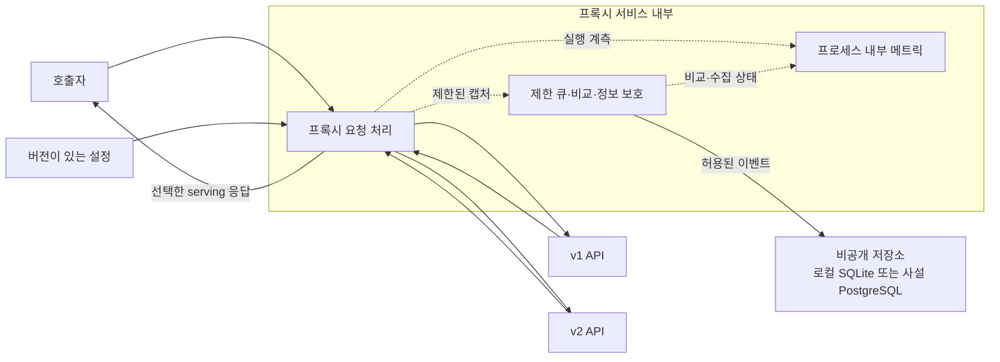

# 실행 구조와 기술 스택 선택

이 문서는 Proxy 내부에서 관측을 처리하는 기본 구성과 저장소·선택 연동의 계약을 정의한다. 선정된 구현 스택은 Python/FastAPI이다. 실행 인프라와 외부 관측 제품은 실제 운영 조건에 따라 별도로 선택한다. 아래 내용은 제품 계약이며, 현재 코드에 연결된 기능과 기본값은 [구현 구성](../implementation/README.md)에서 확인한다. serving, shadow, revision의 의미는 [공통 용어](../_rules/glossary.md)를 따른다.

## 기능 계약

| 항목 | 정의 |
| --- | --- |
| 시작 조건·입력 | 기존 진입·배포 환경, HTTP 계약, 내부 관측의 조회·보존 요구, 요청과 응답 후 작업의 수명, 가용성·복귀 요구, 대표 부하를 확인할 수 있어야 한다. |
| 결과·출력 | 내부 처리, 저장소, 필요한 조회·전송 경로의 책임과 검증 결과를 기록한다. |
| 실패·제한 | 메트릭·상태의 HTTP endpoint와 활성화 설정은 제공하지 않는다. 내부 계측·snapshot·상태 조회·비교·보호·제한 큐는 유지한다. 관측 저장의 성공을 사용자 응답의 완료 조건으로 삼지 않는다. |

## 제품과 외부 시스템의 경계

- 제품의 실행 대상은 Python/FastAPI Proxy이다. 호출자와 v1·v2 API는 설정으로 연결하는 외부 시스템이다.
- backend 주소와 전달 정책은 대상 API의 계약에 따라 지정해야 한다. 외부 API의 생성과 배포는 Proxy가 수행하지 않는다.
- 설정을 적용할 때는 [설정 계약](../routing/configuration.md)에 따라 유효성, revision 식별, 실제 적용 결과를 확인해야 한다.
- Proxy는 [메트릭과 분모](../observability/metrics.md)에 정의한 실행·비교·수집 상태를 내부에서 계측한다. 메트릭 생성에 외부 수집기를 요구하지 않는다.
- 관측 자료는 승인된 접근 경계 안에서 처리하고 저장한다. 메트릭·상태는 내부 snapshot과 조회 기능으로 확인한다. 제품은 관측 HTTP endpoint나 HTTP export를 지원하지 않는다.
- health는 사용자 API 전달 포트와 분리된 loopback listener에서만 제공한다. 실제 접속 peer도 loopback이어야 한다. token이나 전달 헤더로 이 접근 조건을 완화해서는 안 된다.
- 사용자 API 전달 포트는 기존 전달 계약을 유지한다. 배포 담당자는 호스트 포트 공개, 방화벽과 진입 경로를 제한하여 인터넷에서 이 포트에 직접 접근할 수 없게 해야 한다.
- 관측 저장에서는 저장 완료, 미저장, 유실 여부를 구분해야 한다. 보존·조회·접근 정책을 유지해야 한다. 저장 성공을 사용자 요청의 동기 성공 조건으로 사용해서는 안 된다.

## 최소 논리 구성

```mermaid
flowchart LR
    C[호출자] --> P[프록시 요청 처리]
    subgraph I[프록시 서비스 내부]
        P -. 제한된 캡처 .-> Q[제한 큐·비교·정보 보호]
        P -. 실행 계측 .-> M[프로세스 내부 메트릭]
        Q -. 비교·수집 상태 .-> M
    end
    P --> V1[v1 API]
    P --> V2[v2 API]
    V1 --> P
    V2 --> P
    P -->|선택한 serving 응답| C
    Q -->|허용된 이벤트| S[비공개 저장소<br/>로컬 SQLite 또는 사설 PostgreSQL]
    F[버전이 있는 설정] --> P
```

초기 구성은 프록시 요청 처리, 내부 계측, 제한 큐, 비교·정보 보호·수집 작업을 같은 배포 서비스에 둔다. 별도 수집기, 메시지 브로커 또는 SaaS는 이 처리의 필수 구성에 포함하지 않는다. 기본 CLI는 프록시를 단일 프로세스로 실행한다. 여러 인스턴스를 배치할 때에는 각 프로세스의 자원 한도와 지표·revision 통합을 별도로 설계하고 검증해야 한다.

관측 저장소는 비교·수집 정보를 기록하고 조회하는 용도이다. 요청별 라우팅 판단을 위해 이 저장소를 동기 조회해서는 안 된다. 설정 조회, backend 호출, 비교, 저장을 위해 프레임워크별 추상 계층을 미리 추가하는 방식은 초기 구성에 포함하지 않는다.

이벤트 저장소를 공유해도 프로세스의 메모리에 있는 메트릭이 자동으로 합산되거나 재시작 후 복원되지는 않는다. 여러 인스턴스의 메트릭을 합산하려면 관측 구간, 대상 인스턴스, 중복·누락 처리 기준을 정해야 한다. 이벤트의 영속 저장과 지표 합산은 각각 검증해야 한다.

## 인프라 결정 전제

운영 실행 인프라와 외부 관측 제품은 미정이다. 이벤트 저장소는 단일 호스트의 로컬 SQLite 또는 운영 조건에 따른 사설 PostgreSQL을 선택한다. 실제 배치, 성능, 보존·백업, 비용과 지원 버전은 해당 환경에서 확인해야 한다. 기능과 수명 제약은 [서비스·런타임 후보](../research/service-options-and-constraints.md)를 참고한다.

기존 gateway의 재사용 범위, serving 배정의 담당 구성, 실행 환경을 검토할 때는 [프록시 도구 비교](../research/proxy-patterns-and-tools.md)와 아래 책임을 대조해야 한다.

| 논리 구성 | 선정한 구성에서 충족해야 할 책임 | 후보와 결정 조건 |
| --- | --- | --- |
| 진입 경로 | 승인된 진입 경로에서 프록시 또는 기존 API로 연결할 수 있어야 한다. 프록시 전달 포트를 인터넷에 직접 공개해서는 안 된다. | 기존 로드밸런서, gateway, DNS 구성과 프록시 장애 시 우회 요구부터 확인한다. 실제 포트 공개와 네트워크 접근 정책을 검증한다. |
| 프록시 실행 | HTTP 전달, 적격 요청의 양쪽 실행, 캡처·비교·비동기 적재를 수행해야 한다. | Python/FastAPI를 사용한다. 동시성, 취소, body 전달, 대표 부하 요구를 실행 환경의 제약과 대조한다. |
| 관측 저장소 | 허용된 비교 요약과 선택한 상세를 기록·조회·만료 처리해야 한다. | 단일 호스트의 로컬 SQLite로 요구를 충족할 수 있는지 먼저 확인한다. 여러 호스트의 쓰기나 쓰기 경합을 처리해야 하면 사설 PostgreSQL을 검토한다. |
| 메트릭·로그 | serving, backend, 비교, 수집 상태를 내부에서 계측하고 운영 로그의 허용 필드를 제한해야 한다. | 메트릭·상태의 HTTP endpoint는 제공하지 않는다. 원문 요청·응답, credential, 원문 예외를 로그나 메트릭 label에 넣어서는 안 된다. |
| 설정 배포 | revision의 검증, 적용, 복구를 관리할 수 있어야 한다. | 기존 설정 파일과 배포 이력으로 요구사항을 충족할 수 있는지 검토한다. |
| 비밀·권한 | backend 인증과 저장소 접근을 관리해야 한다. | 조직의 기존 관리 방식을 따른다. 설정에 credential 원문을 저장해서는 안 된다. |

운영 가용성을 검증하기 전에 단일 인스턴스로 충분하다고 확정해서는 안 된다.

## 구현 스택과 기술 후보별 확인 사항

### AWS

AWS는 실행 환경을 검토할 때의 후보이며 채택이 확정된 상태가 아니다. 먼저 기존 네트워크, 리전, 배포 도구와의 적합성을 확인하십시오. 프록시와 v1/v2 사이의 왕복 경로, 관측 저장소 접근, 장애 시 우회, 운영 비용을 결정 근거로 사용하십시오.

멀티 리전, Kubernetes, 외부 메시지 브로커는 초기 필수 구성으로 지정하지 않는다. 관리형 실행 환경을 선택하기 전에 다음 항목을 실제 제품·버전의 제약과 대조하십시오.

- 요청 제한 시간과 연결·body 처리 방식이 대상 HTTP 계약을 충족하는지 확인하십시오.
- 정상 종료 유예 시간 안에서 요청과 내부 작업을 정해진 한도까지 배출할 수 있는지 확인하십시오.
- 사용자 응답이 끝난 뒤에도 시작된 shadow가 자신의 수명 계약에 따라 실행될 수 있는지 확인하십시오.
- 요청 복제와 사용하는 관측·로그 경로의 네트워크·저장 비용을 확인하십시오.

플랫폼이 백그라운드 실행 기능을 제공한다는 사실만으로 내부 작업의 완료가 보장된다고 가정하지 마십시오.

ECS의 container healthcheck는 컨테이너 안에서 실행하는 명령이며 loopback의 애플리케이션에 연결한다. 이 제품을 ECS에 배치한다면 task definition의 healthcheck 명령이 내부 `GET /healthcheck`를 호출하도록 구성한다. 이미지에 적힌 healthcheck만으로 ECS의 상태 검사가 구성되었다고 가정해서는 안 된다. [ECS container healthcheck](https://docs.aws.amazon.com/AmazonECS/latest/developerguide/healthcheck.html)를 따른다.

ALB의 HTTP healthcheck 경로는 설정할 수 있으며 기본 경로는 `/`이다. `/healthcheck`가 AWS의 고정 경로인 것은 아니다. ALB는 이 제품의 loopback 전용 health listener에 직접 접근할 수 없다. ALB를 사용한다면 target의 점검 경로와 container 내부 상태 확인을 구분하여 설계해야 한다. 이를 위해 제품의 health listener를 외부 주소에 바인딩해서는 안 된다. [ALB healthcheck 설정](https://docs.aws.amazon.com/elasticloadbalancing/latest/application/target-group-health-checks.html)을 따른다. 이 안내는 실제 AWS 배포를 구성하거나 검증했다는 뜻이 아니다.

### FastAPI 구현과 실행 모델

FastAPI는 Proxy의 HTTP 진입점에 사용한다. 사용자 요청 처리와 내부 관측은 책임을 분리한다. 별도 loopback listener는 단일 healthcheck만 제공한다. 운영 실행 모델을 결정하기 전에 HTTP 클라이언트와 서버 실행 모델을 함께 검증하십시오.

- 연결 재사용, 자동 redirect·retry, TLS, header 처리, 요청 body 복제, client 취소 전파가 [HTTP 전달 계약](../routing/http-forwarding.md)을 유지하는지 확인하십시오.
- 응답 후 task를 시작할 수 있다는 사실과 shadow의 최대 수명, 종료, 유실 조건을 구분하십시오. 작업 시작 기능만으로 이 조건이 충족되었다고 판단하지 마십시오.
- JSON 비교와 마스킹의 CPU 부하가 사용자 요청 처리에 미치는 영향을 측정하십시오. 공유 실행 자원에서 요구사항을 충족하지 못하면 같은 서비스 내부의 작업 실행 예산 분리를 검토하십시오.
- 검증 전에 특정 worker, thread, process 수를 운영 구성으로 고정하지 마십시오.
- worker 프로세스마다 실행 제한, HTTP·DB 연결 pool, 내부 큐가 독립적으로 생성되는지 확인하십시오. 독립적으로 생성되는 자원은 인스턴스 전체 예산으로 합산하십시오.

### 로컬 SQLite와 사설 PostgreSQL

SQLite는 단일 호스트에서 이벤트를 저장하는 운영 구성에도 사용할 수 있다. 개발 전용 저장소로 제한하지 않는다. 파일별로 한 번에 하나의 writer가 기록하므로 쓰기, 조회, 만료 삭제의 경합을 실제 부하에서 확인해야 한다. 여러 프로세스가 같은 호스트의 파일을 사용할 수 있지만 이 사실이 쓰기 병렬성을 보장하지는 않는다. [SQLite의 적용 기준](https://www.sqlite.org/whentouse.html)을 따른다.

SQLite 파일은 해당 호스트의 영속 저장소에 둔다. 여러 호스트가 네트워크 파일시스템의 같은 파일을 직접 공유하는 구성을 기본 확장 방법으로 사용하지 않는다. WAL을 선택해도 이 경계는 유지된다. WAL은 읽기와 쓰기의 동시성을 개선할 수 있지만, 사용하는 프로세스가 같은 호스트에 있어야 하며 동시에 기록하는 writer는 하나이다. WAL 채택은 별도 설정·검증 사항이다. [SQLite WAL 제약](https://www.sqlite.org/wal.html)을 따른다.

여러 호스트에서 같은 이벤트 저장소에 기록하거나 SQLite의 쓰기 경합이 예산을 넘으면 사설 PostgreSQL을 검토한다. PostgreSQL은 여러 클라이언트가 서버에 연결하는 구조이다. DB 연결은 승인된 사설 네트워크와 계정으로 제한한다. 수신 주소, 연결 인증, 필요한 암호화와 비밀 관리는 배포 담당자가 설정한다. 이 선택이 공용 인터넷 공개나 SaaS 관측 전송을 요구하지는 않는다. [PostgreSQL 구조](https://www.postgresql.org/docs/current/tutorial-arch.html)와 [연결 설정](https://www.postgresql.org/docs/current/runtime-config-connection.html)을 따른다.

두 저장 방식에 같은 이벤트·ACK·보존 계약을 적용해야 한다. 특정 배포의 저장소 선택은 다음 항목을 검증한 뒤 결정한다.

- 핵심 조회 키인 event ID, 기간, route, 결과를 기준으로 필요한 조회를 검증하십시오. 모든 응답 필드에 미리 인덱스를 생성하지 마십시오.
- 배치 적재와 만료 삭제가 동시에 실행될 때 각각의 처리량, 지연, 적체를 확인하십시오.
- DB 장애가 serving 경로의 완료 조건에 영향을 주지 않는지 확인하십시오.
- 저장 재시도 이벤트가 중복 집계되지 않는지 확인하십시오.
- 실제 적재량을 측정한 뒤 partition이나 별도 분석 저장소의 필요성을 결정하십시오.
- raw body 전량 저장이나 장기 보존을 저장소 선정의 기본 전제로 삼지 마십시오. 수집 범위와 기간은 해당 데이터 정책을 따라야 한다.

### 외부 관측 도구의 검토 범위

내부 계측·비교·정보 보호는 Proxy가 수행한다. 별도 도구가 필요한 이유는 여러 인스턴스의 지표 합산, 장기 추세 조회, 대시보드 또는 오류 조사 등으로 한정하여 설명해야 한다. 아래 도구는 목적별 검토 대상이며 운영 필수 구성이나 채택 완료 목록이 아니다. 제품에는 메트릭·상태의 HTTP endpoint와 이를 켜는 옵션이 없으므로 해당 경로를 사용하는 연동 절차를 가정해서는 안 된다.

이 문서의 외부 관측 전송은 Proxy 밖의 수신 주체에 메트릭·로그·trace를 보내는 동작이다. 조직 내부의 별도 collector도 이 수신 주체에 포함한다. 설정으로 선택한 이벤트 저장소에 허용된 이벤트를 기록하는 동작은 별도 저장 계약을 따른다. 조직 밖이나 SaaS로 자료를 보내려면 해당 데이터 반출 조건도 충족해야 한다.

| 선택지 | 사용할 수 있는 목적 | 적용 조건 |
| --- | --- | --- |
| [Prometheus](https://prometheus.io/docs/introduction/overview/) | 여러 프로세스의 수치 메트릭을 수집하고 시계열로 조회·집계한다. | 이 제품은 HTTP 수집 endpoint를 제공하지 않는다. 다른 계측 원천과의 연결이 필요한 경우에만 별도로 검토한다. 개별 비교 이벤트 저장은 별도이다. |
| [Grafana](https://grafana.com/docs/grafana/latest/introduction/) | 선택한 데이터 원천을 조회·시각화하고 알림을 구성한다. | 사설 배치와 관리형 서비스를 구분하여 선택한다. 화면 권한만으로 데이터 원천의 접근 통제가 충족된다고 가정하지 않는다. |
| [CloudWatch Logs](https://docs.aws.amazon.com/AmazonCloudWatch/latest/logs/WhatIsCloudWatchLogs.html) | AWS 환경에서 운영 로그를 수집·조회한다. | AWS 사용이나 로그 전송이 필요하다는 별도 결정이 있어야 한다. 전송 필드·대상 계정·리전·보존 조건을 확인한다. |
| [Sentry](https://docs.sentry.io/api/discover/) | 오류·성능 이벤트를 조회하고 조사한다. | 전송할 오류 문맥과 제외할 민감 필드를 정한다. SDK 설치만으로 관측 자료를 자동 전송해서는 안 된다. |
| [Loggly](https://documentation.solarwinds.com/en/success_center/loggly/content/admin/about-loggly.htm) | SaaS에서 로그를 모아 검색·분석한다. | 조직 밖 전송을 승인한 경우에만 사용한다. 로컬 로그 생성과 별도 결정이다. |
| [OpenTelemetry](https://opentelemetry.io/docs/what-is-opentelemetry/) | 메트릭·로그·trace의 계측과 전송 방식을 연결한다. | 수신 주체와 exporter를 별도로 선택한다. 규격을 채택했다고 외부 collector나 SaaS가 필수가 되지는 않는다. |

외부 도구를 사용하려면 자료의 노출 범위, 전송 필드, 접근 주체와 보존 조건을 먼저 정해야 한다. 내부 snapshot 조회가 외부 전송 권한을 부여하지는 않는다. 메트릭도 비밀값을 담는 경로로 사용해서는 안 된다. Prometheus의 보안 모델은 메트릭을 비밀 정보로 취급하지 않으므로 연동을 검토하는 경우에도 별도 접근 경계가 필요하다. [Prometheus 보안 모델](https://prometheus.io/docs/operating/security/)을 따른다.

[k6](https://grafana.com/docs/k6/latest/)는 부하 검증 도구이고 [K3s](https://docs.k3s.io/)는 Kubernetes 배포판이다. 두 도구는 관측 데이터 수집기나 이벤트 저장소를 대신하지 않는다. 필요한 부하 실험 또는 배포 방식이 정해진 경우에만 선택한다.

## 실행 상태와 종료 확인

| 확인 대상 | 필요한 계약 | 판단 경계 |
| --- | --- | --- |
| 요청 수락 준비 | loopback의 `GET /healthcheck`가 유효한 활성 설정, 필수 실행 자원과 신규 요청 수락 가능 상태에 따라 200 또는 503과 최소 본문을 반환해야 한다. | 프로세스 생존만으로 200을 반환해서는 안 된다. 이 응답은 backend 정상, 저장 성공, cache 준비나 전환 준비를 입증하지 않는다. 관측 저장소 장애만을 이유로 정상 serving을 제외해서는 안 된다. |
| 전환 준비 | gate별 데이터, 권한, 대표 부하, 복귀 증거를 확인해야 한다. | 프로세스 readiness와 구분되는 운영 판단이다. |
| 정상 종료 | 신규 수락을 중지해야 한다. serving, shadow, 내부 큐는 정해진 한도 안에서 배출해야 한다. | 배출 제한 시간 초과나 강제 종료로 작업이 유실될 수 있음을 기록해야 한다. |

health listener는 loopback에만 바인딩하고 실제 접속 peer도 loopback인지 확인해야 한다. token 인증, 전달 헤더 또는 peer 검증 우회로 외부 접속을 허용해서는 안 된다. `GET /healthcheck` 외에 `/health/live`, `/health/ready`, `/metrics`, `/state`는 제공하지 않는다. 단일 health 응답에는 준비 여부만 포함하며 route·revision·메트릭·상세 설정을 포함해서는 안 된다.

이 제한은 별도 health listener의 계약이다. 사용자 API 전달 포트는 같은 path를 포함한 요청도 기존 backend 전달 계약에 따라 처리한다. 현재 프로세스의 readiness만으로 다른 프로세스나 외부 시스템까지 준비되었다고 판단해서는 안 된다.

정상 종료를 검증할 때는 진입점의 등록 해제·요청 차단과 애플리케이션의 serving·응답 후 작업 배출을 각각 확인해야 한다. HTTP 연결 배출이 완료되었다는 사실만으로 내부 비교·저장 작업도 완료되었다고 판단해서는 안 된다.

종료 예산은 요청 연결, serving, shadow, 내부 큐, 자원 정리의 전체 수명을 포함하여 정해야 한다. 각 단계에 제한 시간이 있다는 이유로 그 합이나 실제 전체 종료 시간이 자동으로 보장된다고 가정해서는 안 된다. 응답 후 작업의 유실 허용 범위와 종료 유예 시간은 수집 계약, 복귀 목표, 플랫폼 수명을 함께 대조하여 검증해야 한다.

## 최소 운영 토폴로지의 결정 기준

대상 API의 HTTP 계약, 응답 후 shadow 수명, 정상 종료, 관측 장애 격리, 복귀 목표 시간, 대표 부하는 모두 확인 대상이다. 운영 배치의 결정 절차는 다음과 같다. 2~4단계의 검증 사이에는 필수 선후관계가 없다. 각 검증 조건을 유지할 수 있으면 독립적으로 수행할 수 있다.

1. 기존 진입·배포 환경과 Proxy 내부 처리·저장으로 요구사항을 충족할 수 있는 최소 구성을 검토하십시오.
2. 검토한 구성의 HTTP 전달과 요청·응답 후 작업 수명이 위 계약을 충족하는지 검증하십시오.
3. 관측 경로 장애, 프록시 장애, 정상 종료 조건에서 serving과 복귀 요구를 충족하는지 검증하십시오.
4. [용량·비용 기준](capacity-and-cost.md)에 따라 대표 부하와 비용 예산을 확인하십시오.
5. 2~4단계의 검증 결과와 남은 제약을 기록하십시오.
6. 기록한 검증 결과를 근거로 채택 여부를 결정하십시오.

   - 필요한 정보나 증거가 없으면 그 항목을 미정으로 유지하십시오.

별도 worker 서비스와 외부 브로커는 내부 처리·제한 큐가 성능, 내구성 또는 장애 격리 요구를 충족하지 못한다는 증거를 확인한 뒤 검토한다. 저장소는 위 호스트·쓰기 조건에 따라 선택한다. 내부 집계와 저장 자료의 분석 요구를 먼저 확인하고, 외부 도구가 필요하면 제품의 관측 HTTP 지원을 전제하지 않는 별도 구성을 검토한다. 이 문서는 특정 클라우드나 관측 제품의 도입을 확정하지 않는다.

## 검증 기준

실행·저장 경계와 정상 종료는 [T-13, T-24, T-35, T-36, T-39](../validation/test-catalog.md)의 관련 시나리오로 확인해야 한다. 단일 healthcheck, 관측 HTTP 미제공과 비공개 배포 경계는 [T-47](../validation/test-catalog.md#t-47-내부-관측단일-healthcheck비공개-접근-검증)로 확인해야 한다. 검증 결과에는 실제 대상 환경, 충족한 조건, 남은 제약을 구분하여 기록해야 한다.

## 관련 기능

- [품질 목표](../validation/quality-and-acceptance.md)
- [용량·비용 검증](capacity-and-cost.md)
