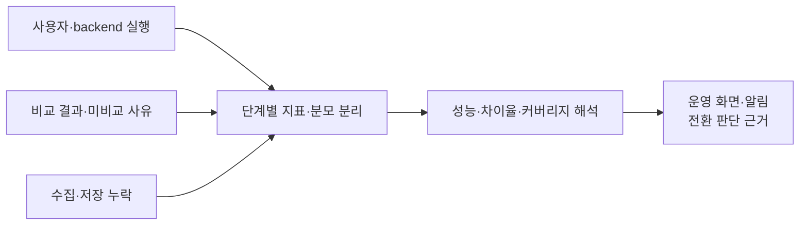

# 관측

사용자·backend·비교·수집 지표를 분리하고 누락을 포함한 운영 판단 근거를 제공한다.

저장된 이벤트만으로 전체 요청을 추정하지 않고, 각 처리 단계의 분모와 누락을 함께 확인한다. 차이가 관측되지 않은 상태와 충분히 비교해 일치를 확인한 상태를 구분한다.

## 기능별 문서

| 기능 | 상세 범위 |
| --- | --- |
| [메트릭 계측](metrics.md) | 지표 종류, label 범위와 지연 측정 |
| [커버리지·실험 분석](coverage-and-analysis.md) | 분모, 비교 완료율·차이율과 해석 한계 |
| [운영 화면·알림](dashboards-and-alerts.md) | 현재 전환, 사례 조사와 장애 신호 |

[전체 도메인](../README.md)
