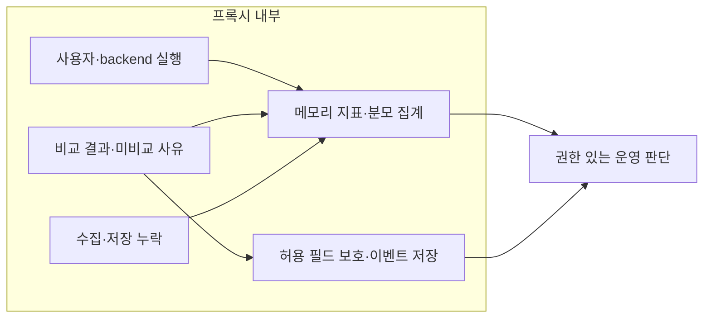

# 관측

프록시는 사용자 요청, backend 실행, 비교 판정과 이벤트 수집을 내부에서 각각 계측한다. 비교, 지표 집계와 데이터 보호는 프록시가 담당한다. 운영 담당자는 이 지표를 사용하여 사용자 영향, 계약 차이와 관측 누락을 구분한다.

## 내부 처리와 health 경계

내부 계측은 외부 수집기나 관측 서비스 없이 동작해야 한다. 프록시는 메트릭·상세 상태의 HTTP 조회를 제공하지 않으며, 이를 활성화하는 설정도 제공하지 않는다. 내부 snapshot과 상태 조회 함수는 계측·비교·이벤트 수집을 확인하는 내부 인터페이스로 유지한다.

| 구분 | 기본 책임과 경계 |
| --- | --- |
| 내부 메트릭 | 프록시가 메모리에서 횟수, 지연 분포와 현재 작업 상태를 집계한다. |
| 비교 이벤트 | 선택된 shadow 요청의 실행 결과와 비교 판정을 보호한 뒤 이벤트 저장소에 기록한다. 현재 SQLite 저장소의 개별 status·지연 기록은 전체 메트릭 집계를 대신하지 않는다. |
| 내부 상태 확인 | 메트릭 snapshot과 `observation_status()`를 프로세스 내부에서 사용한다. 관측 HTTP API나 전용 조회 CLI를 뜻하지 않는다. |
| 외부 관측 연동 | 외부 수집기·SaaS로 보내는 SDK나 exporter는 연결하지 않는다. 선택한 이벤트 저장소에 기록하는 동작과 구분한다. |
| Health 확인 | 전용 loopback listener의 `GET /healthcheck` 하나만 제공한다. 요청 수용 가능 상태이면 200과 `{"ready":true}`, 그렇지 않으면 503과 `{"ready":false}`를 반환한다. |

Health listener의 바인드 주소와 실제 접속 peer를 모두 loopback으로 제한해야 한다. 인증 token이 있다는 이유로 외부 바인드나 외부 peer를 허용해서는 안 된다. Health 경로의 별칭을 제공하지 않으며, 응답에 route 목록·메트릭·설정 정보를 추가해서는 안 된다.

메트릭에는 내부 route와 트래픽 규모가 드러날 수 있다. 허용 필드만 남긴 이벤트 요약에도 식별자와 시각을 통한 상관 정보가 남는다. 두 데이터를 공개 가능한 익명 정보로 취급해서는 안 된다. 조회·로그·외부 전송의 보호 기준은 [인증·권한과 데이터 책임](../_rules/identity-and-data-boundaries.md)을 따른다.

현재 메트릭은 프로세스 메모리에 있으며 재시작하면 초기화된다. SQLite의 비교 이벤트가 남아 있어도 전체 요청 수와 유실된 메트릭 구간을 복원할 수는 없다. 보존하지 못한 구간은 미확인으로 표시해야 한다. 외부 관측 제품의 일반 기능은 [기술 자료](../research/observability-and-storage.md)에서 비교하며, 현재 제품이 해당 연동을 제공한다는 뜻은 아니다.

## 관측값의 해석

저장된 비교 이벤트만으로 전체 요청 수를 추정해서는 안 된다. 각 처리 단계의 분모, 진행 중인 작업과 확인된 누락을 함께 검토해야 한다. 차이가 관측되지 않았더라도 비교 표본이 없거나 수집이 누락됐다면 일치를 확인한 상태로 판단해서는 안 된다.

운영 담당자는 다음 순서로 관측값을 확인하십시오.

1. 대상 route, 관측 구간과 설정·배포 조건을 정하십시오.
2. 사용자·backend·비교·수집 지표의 수집 범위와 완전성을 확인하십시오.
3. 같은 요청 집단의 단계별 분모와 누락 사유를 확인하십시오.
4. 관측 조건과 분모에 따라 지연·차이율·비교 커버리지를 해석하십시오.
5. 해석한 결과를 [전환 gate](../rollout/stages-and-gates.md)에 필요한 증거와 대조하십시오.

필요한 분모나 관측 조건을 확인할 수 없으면 해당 판단을 미확인으로 기록해야 한다. 한 프로세스의 상태 조회나 오류 0건만으로 전체 서비스의 전환 준비가 완료됐다고 판단해서는 안 된다.

```mermaid
flowchart LR
    subgraph Proxy["프록시 내부"]
        A["사용자·backend 실행"] --> D["메모리 지표·분모 집계"]
        B["비교 결과·미비교 사유"] --> D
        C["수집·저장 누락"] --> D
        B --> E["허용 필드 보호·이벤트 저장"]
    end
    D --> F["권한 있는 운영 판단"]
    E --> F
```

## 기능별 문서

| 기능 | 이 문서에서 확인할 내용 |
| --- | --- |
| [메트릭 계측](metrics.md) | 각 지표의 갱신 지점, label 제한, 지연 측정 경계와 프로세스 집계 규칙을 확인한다. |
| [커버리지·실험 분석](coverage-and-analysis.md) | 요청 집단의 분모, 구간 마감, 비교 완료율·차이율과 미확인 상태의 해석을 확인한다. |
| [운영 화면·알림](dashboards-and-alerts.md) | 현재 상태의 필수 표시 항목, 사례 조사 순서와 장애 신호별 대응 기준을 확인한다. |

[전체 도메인](../README.md)
