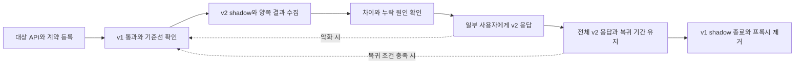

# 제품 개요와 도메인 경계

API Migration Proxy는 기존 API인 v1과 신규 API인 v2의 실행 결과를 관측하면서 사용자 응답을 점진적으로 전환하는 임시 프록시이다. 이 문서는 제품의 목적, 책임 경계, 성공 기준과 전체 적용 흐름을 정의한다. serving, shadow, route, cohort, revision, epoch의 의미는 [공통 용어](../_rules/glossary.md)를 따른다.

## 제품 방향과 결정 상태

| 항목 | 내용 |
| --- | --- |
| 상태 | 이 문서는 제품 기능과 적용 조건의 공식 기준이다. 현재 구현 구성은 [구현 구성](../implementation/README.md)에서 확인한다. |
| 확정된 방향 | 제품은 단순한 API 마이그레이션 프록시이다. 복제 적격 요청의 v1/v2 실행, 비교 데이터와 메트릭 수집, 점진적인 사용자 응답 전환을 제공한다. |
| 배경 | Elasticsearch 클러스터 마이그레이션의 요청 분기, 응답 선택, 관측 원리를 일반 API에 적용한다. |
| 실행 범위 | Proxy 구현 스택은 Python/FastAPI이다. 운영 실행 인프라, 관측 플랫폼, 저장소 제품은 미정이다. |
| 초기 범위 | 제한된 수의 부작용 없는 HTTP JSON API부터 적용한다. |
| 운영값 | 대상 경로, QPS, timeout, 표본율, 보존 기간, 서비스 수준 목표인 SLO, 승격 기준은 대상 API별로 결정해야 한다. 이 문서는 해당 운영값을 확정하지 않는다. |

호출자와 v1·v2 API는 프록시에 연결하는 외부 시스템이다. 해당 애플리케이션의 구현과 배포는 Proxy 제품의 책임에 포함하지 않는다. 대상 API의 계약, 대표 부하, 운영 조건을 확인한 뒤 그 환경에 적용할 세부 조건과 수치를 확정해야 한다. 문서에 제시한 예시 수치를 운영 기본값으로 사용해서는 안 된다.

## 문제 정의

API 구현체, 프레임워크, 서비스 경계 또는 실행 인프라를 변경할 때 사전 테스트의 제한된 입력만으로 실제 권한, 데이터 상태, 피크 부하를 모두 재현하기는 어렵다. 일괄 전환하면 특정 조건에서 발생하는 차이를 사용자가 이미 신규 응답을 받은 뒤에 발견할 수 있다.

단순한 트래픽 분산은 서로 다른 요청을 v1과 v2에 보내므로 동일 요청에 대한 결과를 직접 비교하기 어렵다. 요청만 복제하고 응답과 실패를 수집하지 않으면 반대편 실행 여부는 확인할 수 있어도 계약 차이나 누락 원인은 판단하기 어렵다. 제품은 이 문제를 요청 분기, 양쪽 결과의 수집·비교, 관측 증거에 따른 점진적 전환으로 다룬다.

## 제품 목표

- v1/v2의 공통 진입점을 제공하여 호출자의 변경 범위를 제한한다.
- 동일 요청의 상태 코드, 응답 계약, 지연과 실패를 연결하여 차이의 원인을 조사할 수 있게 한다.
- 사용자에게 노출하는 v2 응답 비율을 shadow 실행 비율과 독립적으로 조정할 수 있게 한다.
- 비교 실패와 수집 누락을 드러내어 근거가 부족한 상태에서 다음 전환 단계로 확대하지 않게 한다.
- 장애 위치에 따라 shadow 중지, 이후 요청의 v1 serving 복귀, 프록시 우회를 구분할 수 있게 한다.
- 업무 로직에 대한 의존을 최소화하고, 마이그레이션 종료 후 제거할 수 있는 구성을 유지한다.

성능, 가용성, 지원 범위의 충족 여부는 실제 목표값과 실행 환경을 정한 뒤 검증해야 한다. 제품은 모든 환경에서 무중단 전환, 추가 지연 0, 모든 HTTP 기능 지원 또는 데이터의 완전한 일치를 보장하지 않는다.

## Elasticsearch 마이그레이션에서 가져오는 원리

기존 대상과 신규 대상의 실행을 유지하면서 사용자 응답을 어느 쪽에서 제공할지만 단계적으로 바꾼다는 원리를 적용한다. 독립 데이터 저장소의 초기 적재와 변경분 동기화는 읽기 결과 비교와 다른 책임이다. API 쓰기를 양쪽에 복제하려면 성공 확인인 ACK, 내구성 있는 기록, 재처리 계약을 별도로 정해야 한다.

| 클러스터 마이그레이션 관점 | API 마이그레이션에서의 의미 |
| --- | --- |
| old/new 클러스터 | v1/v2 API 구현체 또는 배포 대상을 구분한다. |
| 배치·스트리밍 쓰기의 양쪽 반영 | 독립 데이터 저장소의 초기 적재와 지속 동기화 계약을 확인한다. API 쓰기 복제는 별도로 검토한다. |
| 양쪽 검색 실행 | 복제 가능한 동일 요청을 양쪽 API에서 실행한다. |
| 사용자별 응답 선택 | 안정적인 cohort 또는 무상태 요청 단위로 serving을 배정한다. |
| 데이터·성능 관측 | API 계약 차이, 실행 오류, 사용자 지연, 데이터 문맥을 관측한다. |
| old로 되돌릴 준비 | v1의 데이터, 스키마, 권한, 용량이 현재 요청을 처리할 수 있는 상태인지 확인한다. |
| old 검색 중단과 리소스 종료 | v1 shadow 종료, 잔존 호출자 정리, 프록시 제거를 별도 단계로 수행한다. |

검색 순위, 점수, 샤드, 인덱스 세대와 같은 Elasticsearch 전용 개념은 기본 모델에 포함하지 않는다. 업무별 비교 규칙은 실제 대상 API에 필요한 경우에만 확장을 검토한다.

초기 범위를 읽기 API로 제한하는 이유는 구성을 단순하게 유지하고 중복 실행의 업무 효과를 통제하기 위해서이다. 결제, 알림, 예약 등의 쓰기 확장은 [권한·데이터 책임](../_rules/identity-and-data-boundaries.md)의 선행 계약을 확인한 뒤 별도로 결정해야 한다. 프록시는 직접 v2 경로와 복귀 조건을 검증한 뒤 제거해야 한다.

원리의 상세 적용은 [Elasticsearch 방식의 API 적용](../research/elasticsearch-reference.md)을, 리팩토링과 전환 패턴의 근거는 [API 마이그레이션 적용 경계](../research/refactoring-and-migration.md)를 따른다.

## 사용자와 책임

| 사용자 | 필요한 결과 | 주 책임 |
| --- | --- | --- |
| API 개발자 | 어떤 입력과 조건에서 v1/v2가 다른지 확인할 수 있어야 한다. | 공개 계약, 부작용, 성공·오류 분류와 비교 정책을 정의한다. |
| 마이그레이션 담당자 | 다음 전환 비율을 결정할 수 있는 증거를 확보해야 한다. | 단계 변경, 관측 구간, 결과 기록과 종료를 관리한다. |
| 운영 담당자 | 프록시와 shadow가 서비스에 미치는 영향을 확인할 수 있어야 한다. | 자원 한도, 배포, 알림, 장애 복구와 우회를 관리한다. |
| 데이터 담당자 | 데이터 시차와 구현 차이를 구분할 수 있어야 한다. | 독립 DB의 동기화, 최신성·스키마와 롤백 데이터 계약을 관리한다. |
| 서비스 책임자 | 실제 사용자 경험과 업무 영향을 확인할 수 있어야 한다. | 허용 회귀, 중요 업무 불변식, 사용자 지표를 판단한다. |

한 사람이 여러 역할을 겸할 수 있다. 이 역할 구분은 별도 조직이나 시스템을 요구하지 않는다. 다만 대상 API별로 연락 가능한 소유자를 한 명 이상 지정해야 한다.

## 성공 지표

| 성공 관점 | 판단 근거 |
| --- | --- |
| 기능 | 대상 route에서 serving 선택, 적격 요청의 양쪽 실행, 선택된 응답 전달이 계약대로 동작한다는 증거가 있어야 한다. |
| 품질 | 관측한 응답 차이, 오류, 지연이 대상 API에 대해 사전에 정한 기준을 충족해야 한다. |
| 관측 | 표본, 비교 완료율, 유실이 정한 기준을 충족해야 한다. 주요 차이의 원인을 추적할 수 있어야 한다. |
| 운영 | 의도한 설정이 실제 적용되었는지 확인해야 한다. v1 복귀와 프록시 우회에 걸린 시간을 측정해야 한다. |
| 비용 | shadow와 수집이 만드는 추가 부하와 비용이 정한 예산 안에 있어야 한다. |
| 종료 | v1 잔존 호출과 프록시 의존을 정리해야 한다. 직접 v2 호출이 공개 계약을 유지하는지 검증해야 한다. |

지표 목표값은 [품질 요구사항](../validation/quality-and-acceptance.md)에 따라 실제 대상 환경에서 확정해야 한다. QPS, 비율, 지연, 비용 목표는 대상 API의 기준선과 운영 예산을 근거로 정해야 한다. 목표값 또는 측정 증거가 없는 항목은 성공으로 판정해서는 안 된다.

## 전체 사용 흐름

아래 순서는 마이그레이션 담당자가 대상 route에 적용하는 운영 단계이다. 한 요청 안에서 serving과 shadow를 직렬로 실행한다는 의미는 아니다. 각 단계의 세부 진입·완료 조건은 [전환 단계와 승격 판단](../rollout/stages-and-gates.md)을 따른다.

사용자 응답 비율과 shadow 실행 비율은 독립적으로 제어한다. 따라서 v2 serving 비율이 100%여도 shadow를 유지하면 v1 요청이 발생할 수 있다. 그림의 복귀 경로를 사용할 때는 v1의 데이터, 권한, 계약, 용량과 실제 복귀 경로가 기준을 충족하는지 먼저 확인해야 한다. 상세 조치는 [복귀와 우회](../rollout/rollback-and-bypass.md)를 따른다.

양쪽 API가 성공했거나 응답이 일치한 사실은 데이터 정합성, 사용자 경험, 운영 전환 성공을 각각 입증하지 않는다. 이 세 항목은 해당 계약과 지표에 따라 별도로 판단해야 한다.

## 도메인 경계

| 영역 | 소유하는 판단 | 다음 영역으로 넘기는 결과 |
| --- | --- | --- |
| 요청 라우팅 | 요청에 사용할 route, 설정, serving을 결정한다. | 요청에 고정한 실행 계획과 사용자 응답 경로를 제공한다. |
| shadow 실행 | 반대편 실행의 적격성, 표본 선택, 실행 수명을 결정한다. | v1/v2의 개별 실행 종료 결과를 제공한다. |
| 응답 비교 | 어떤 문맥과 정책에서 같은 결과로 판정할지 결정한다. | 비교 상태, 이유, 제한된 차이 정보를 제공한다. |
| 데이터 수집 | 기록, 조회, 보존할 정보와 처리 한도를 결정한다. | 저장된 고유 이벤트와 수집 상태를 제공한다. |
| 관측 | 실행·비교·저장의 분모와 지연을 어떻게 해석할지 결정한다. | 사용자 품질, 비교 신뢰도, 수집 품질을 판단할 증거를 제공한다. |
| 전환 관리 | 증거에 따라 확대, 유지, 복귀, 종료 여부를 판단한다. | 적용할 단계와 설정 변경 의도를 기록한다. 이 판단 자체가 배포 적용을 의미하지는 않는다. |
| 인프라 | 공통 권한·데이터 기준에 맞춰 실행 환경과 자원을 배치할 조건을 결정한다. | 운영 제약, 용량, 복구 조건을 제공한다. |
| 검증 | 요구사항별 완료 판단에 필요한 절차와 증거를 정의한다. | 검증 결과와 미확인 범위를 제공한다. |

도메인은 문서와 책임을 구분하는 단위이며, 각각을 별도 배포 서비스로 구현할 필요는 없다. 요청 실행, 비교, 수집은 같은 프록시 서비스 안에 배치할 수 있다. 공통 책임 경계는 [권한·데이터 책임](../_rules/identity-and-data-boundaries.md)을, 도메인별 상세 기능은 [문서 목록](../README.md)을 따른다.
