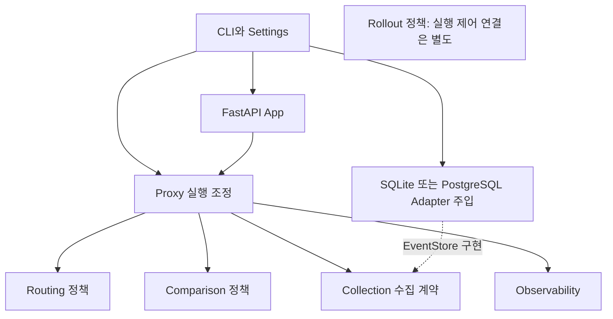

# FastAPI·Python 패키지·도메인 구조 비교

이 문서는 FastAPI 애플리케이션의 패키지 구성과 도메인별 책임 분리 기준을 비교하고, 현재 Python/FastAPI Proxy에 적용한 구조를 설명한다. 외부 문서의 권고, 이 프로젝트의 설계 판단, 현재 코드의 구현 상태를 구분한다.

외부 자료의 확인일은 2026-09-28이다. 자료의 적용 범위와 버전 확인은 [기술 자료 적용과 검증](../_rules/technology-evaluation.md)을 따른다. serving, shadow, route 등의 실행 용어는 [공통 용어](../_rules/glossary.md)를 따른다.

## 조사 결론

FastAPI의 HTTP 진입 구성, Python의 패키지 배치, 업무 책임의 분리는 서로 다른 설계 결정이다. `src/{package}/` 배치 안에서도 도메인별 하위 패키지를 구성할 수 있다. 공식 FastAPI 문서는 여러 파일과 router를 조합하는 방법을 설명하며, 모든 프로젝트에 동일한 도메인 중심 설계(DDD, Domain-Driven Design) 폴더 구조를 요구하지 않는다.

도메인별 패키지는 같은 기능의 정책, 모델, 처리를 함께 찾도록 하는 구조다. 패키지를 나눴다는 이유만으로 각각을 독립 배포 서비스로 분리할 필요는 없다. 반대로 `domain`, `service`, `repository`라는 디렉터리가 있다는 이유만으로 DDD를 적용했다고 판단해서도 안 된다.

이 프로젝트의 중심 책임은 일반적인 데이터 생성·조회·수정·삭제(CRUD)보다 원문 HTTP 전달, 비동기 작업의 수명 조정, 자원 상한이 있는 비교·수집이다. 현재 구조는 이 책임을 기준으로 분리했다.

## 공식 문서·명세

| 자료 | 확인한 내용 | 적용 판단 |
| --- | --- | --- |
| [FastAPI: Bigger Applications](https://fastapi.tiangolo.com/tutorial/bigger-applications/) | Python package와 `APIRouter`로 관련 HTTP 경로의 처리를 분리하고 조합한다. | 상태 확인용 HTTP 경로의 분리에 참고한다. 모든 도메인에 router가 필요하다는 근거로 사용하지 않는다. |
| [FastAPI: Dependencies](https://fastapi.tiangolo.com/tutorial/dependencies/) | HTTP 경로 처리에 필요한 공통 처리, 권한 검사, 연결 등을 의존성으로 제공한다. | HTTP 진입의 인증·접근 검사에 적용한다. 순수 비교·배정 함수를 FastAPI의 `Depends`에 결합할 근거로 사용하지 않는다. |
| [FastAPI: Lifespan](https://fastapi.tiangolo.com/advanced/events/) | 애플리케이션의 시작·종료 처리를 lifespan으로 관리하는 방식을 권장한다. | 현재 app factory, 즉 앱을 생성하는 함수가 runtime의 시작·종료 수명을 소유한다. |
| [PyPA: src layout vs flat layout](https://packaging.python.org/en/latest/discussions/src-layout-vs-flat-layout/) | import 대상 패키지를 `src` 아래에 분리하여 설치된 코드를 사용하도록 유도한다. | 현재 패키징과 양립하는 배치다. 도메인별 하위 디렉터리를 추가하는 것과 충돌하지 않는다. |
| [ASGI HTTP 명세](https://asgi.readthedocs.io/en/latest/specs/www.html) | 원시 경로(raw path), query 바이트, 중복 헤더, body 메시지, 연결 종료(disconnect)의 의미를 정의한다. | HTTP 전달 구조를 변경할 때 보존해야 할 계약의 기준으로 사용한다. 일반 JSON endpoint의 입력·출력 모델만으로 중계 계약을 대체하지 않는다. |

위 자료의 구조 예시는 프로젝트가 선택할 수 있는 구성 방법이며, 운영 성능이나 가용성의 보장 근거가 아니다. 연결한 문서의 버전과 저장소의 설치 버전이 다를 수 있으므로, 새 API를 도입할 때에는 실제 의존성 버전에서 지원하는지 확인해야 한다.

## DDD·설계 자료

### Bounded Context

Bounded Context는 모델의 용어와 규칙이 적용되는 범위 및 다른 모델과의 관계를 명확히 하는 DDD 개념이다. 디렉터리 하나가 독립 Bounded Context 하나에 해당한다고 자동으로 판단해서는 안 된다. [Martin Fowler: Bounded Context](https://martinfowler.com/bliki/BoundedContext.html)

이 프로젝트의 routing, comparison, collection은 하나의 프록시 안에서 기능을 나누는 모듈로 해석한다. 독립 배포, 별도 DB, 메시지 통신의 도입은 조직별 소유권, 배포 수명, 일관성 요구가 있을 때 별도로 결정한다.

### 도메인 정책과 저장 구현 분리

이 접근은 핵심 규칙이 특정 저장 기술에 종속되지 않도록 의존성 방향을 관리한다. 저장 세부 사항을 감추는 작은 인터페이스는 실제 구현 교체나 독립 검증이 필요한 지점에 적용한다. [Cosmic Python: Repository Pattern](https://www.cosmicpython.com/book/chapter_02_repository)

현재 코드는 `EventStore.write_batch` 계약과 SQLite·PostgreSQL 저장 구현을 분리한다. collector는 저장 계약을 호출하며 개별 저장 구현을 직접 참조하지 않는다. 이 사례가 모든 모델에 범용 Repository, 객체와 DB 행을 연결하는 ORM, 여러 변경의 처리 단위를 관리하는 Unit of Work를 추가해야 한다는 의미는 아니다.

### 여러 기능을 연결하는 실행 조정

실행 조정은 HTTP 처리 중 정책과 저장 기능을 호출하고, 그 결과와 수명을 연결하는 책임이다. 핵심 판정 규칙과 실행 조정은 다른 책임이며, 조정 계층은 실제로 여러 기능을 연결하는 지점에만 둔다. [Cosmic Python: Service Layer](https://www.cosmicpython.com/book/chapter_04_service_layer)

현재 프록시의 요청 실행, 비교, 마스킹, 수집 연결은 실행 조정에 해당한다. 입력으로 결과를 판정하는 순수 함수 `compare()`는 큐, 작업 실행기(executor), collector를 연결하는 pipeline과 분리되어 있다.

## 실제 FastAPI 구성 사례

### 공식 Full Stack FastAPI Template

확인한 템플릿에서는 메인 app이 API router를 조합하고, API router가 users, items, login 등의 route를 조합한다. 이 사례에서는 앱 조립과 개별 endpoint 정의의 분리를 참고한다. [app/main.py](https://raw.githubusercontent.com/fastapi/full-stack-fastapi-template/master/backend/app/main.py), [app/api/main.py](https://raw.githubusercontent.com/fastapi/full-stack-fastapi-template/master/backend/app/api/main.py)

이 템플릿은 업무 endpoint를 제공하는 애플리케이션의 예시다. 원문 HTTP 중계나 사용자 응답 이후 shadow의 수명 보장을 설명하는 근거로 그대로 적용해서는 안 된다.

### FastAPI Best Practices 커뮤니티 사례

[FastAPI Best Practices](https://github.com/zhanymkanov/fastapi-best-practices)는 작성자의 다중 도메인 애플리케이션 경험을 바탕으로 도메인 아래 관련 파일을 모으는 구조를 제안한다. 전역 routers/models/services 분류보다 같은 기능의 변경 위치를 가까이 둔다는 점을 참고한다.

이 제안은 FastAPI 공식 표준이나 모든 서비스에 최적인 구조가 아니다. 이 프로젝트에서는 사례의 디렉터리 구성을 맞추기 위해 필요하지 않은 인증(auth), ORM, 데이터베이스 변경(migration), router 파일을 생성하지 않는다.

## 구조 대안 비교

| 대안 | 장점 | 비용·한계 | 적용 조건 |
| --- | --- | --- | --- |
| 기능별 단일 파일 | 작은 기능을 한 위치에서 탐색하고 변경할 수 있다. | 여러 책임이 커지면 탐색과 변경이 한 파일에 집중된다. | 책임의 범위가 작고 명확한 기능에 적용할 수 있다. |
| 전역 routers/models/services/repositories | 기술 역할을 기준으로 코드를 찾기 쉽다. | 같은 기능의 변경이 여러 디렉터리에 분산된다. | 작은 CRUD API 등에서 선택할 수 있다. |
| 도메인·기능별 패키지 | 같은 기능의 정책·모델·검증 책임과 변경 위치를 모을 수 있다. | 패키지 간 의존성과 공개 인터페이스를 관리해야 한다. | 현재 프록시가 적용한 구조다. |
| 각 도메인에 동일한 4계층 DDD | 복잡한 업무 모델과 여러 외부 adapter의 책임을 나누는 데 유리하다. | 빈 계층, 전달만 하는 wrapper, 불필요한 추상화가 늘어날 수 있다. | 실제 업무 복잡도와 구현 교체 요구가 있을 때 검토한다. |
| 도메인별 마이크로서비스 | 독립 배포, 확장, 소유가 가능하다. | 네트워크, 장애 처리, 데이터 일관성, 운영 부담이 증가한다. | 별도 근거가 필요하며 현재 제품 범위에 포함하지 않는다. |

프로젝트는 패키징을 유지하면서 실제 책임이 섞인 부분을 기능별 패키지 안에서 분리했다. 이 선택은 외부 자료와 현재 프록시의 책임을 대조한 프로젝트 판단이며, 외부 문서가 모든 서비스에 이 구조를 일괄 권고한다는 의미가 아니다.

## 현재 코드의 책임 분리

| 책임 | 유지한 부분 | 분리한 책임과 경계 |
| --- | --- | --- |
| HTTP 진입 | app factory와 lifespan이 실행 수명을 관리하며 API 전달 app과 loopback 전용 health app을 구분한다. | 별도 health listener는 `GET /healthcheck` 하나만 제공한다. 메트릭·상태의 HTTP 조회는 제공하지 않는다. |
| 라우팅 | 안정된 cohort, 불변 snapshot, 목적지 제한을 유지한다. | 전체 실행 설정 파일의 로딩과 route 정책을 구분한다. snapshot 파일 로더는 `routing/configuration.py`에 남아 있다. |
| 요청 실행 | ASGI body, disconnect, 실행 기한(deadline), 역할별 HTTP transport를 함께 조정한다. | shadow 정책 설정은 routing이 정의하며, 실제 선택과 실행 수명 조정은 runtime이 수행한다. |
| 비교 | 프레임워크에 의존하지 않는 입력·정책과 순수 비교 함수를 유지한다. | 큐, executor, 저장을 연결하는 pipeline과 비교 판정을 구분한다. |
| 수집 | 자원 상한이 있는 큐, 부분 ACK, 저장 여부 미확인 상태, 허용 필드 규칙을 유지한다. | 이벤트 보호 정책, collector, 조회 계약, SQLite·PostgreSQL 저장 구현을 분리한다. |
| 관측 | 허용한 label, 집계 분모, 비교 가능성의 의미를 유지한다. | 메트릭 수집, 내부 snapshot과 품질 집계를 구분한다. |
| 전환 관리 | 승격 gate, 복귀, 설정 전파의 증거 모델을 유지한다. | 정책 모델과 실제 설정을 변경하는 제어 기능은 별개다. 정책 모듈이 존재한다고 동적 제어가 연결된 것은 아니다. |

현재 구조는 외부 API의 request/response를 Pydantic 모델로 재직렬화하는 방식으로 변경하지 않는다. 또한 collection과 comparison 등 모든 도메인에 HTTP endpoint나 DB 모델을 일률적으로 추가하지 않는다. 이름이 같은 모델이라도 의미, 필드, 수명이 다르면 하나로 통합하지 않는다. 구체적인 공통 책임 없이 빈 shared/core/utils 패키지나 도메인 전체를 감싸는 범용 service를 먼저 만들지 않는다.

## 현재 코드에 적용한 구조

현재 코드는 단일 프록시 내부를 기능별 패키지로 구성한다. 각 디렉터리를 독립 Bounded Context나 마이크로서비스로 선언하지 않는다. 불변 snapshot과 정책 검증, 순수 비교 함수, 저장 인터페이스 주입, 명시적인 자원 제한·종료 계약을 유지한다.

이벤트 보호 정책은 SQLite·PostgreSQL 저장 구현과 분리되어 있다. 관측 모듈은 내부 메트릭 snapshot과 집계 기능을 제공한다. CLI의 객체 조립은 설정 파일 파싱과 분리되어 있다. 아래 표는 현재 적용된 책임 배치를 설명한다.

| 위치 | 소유 책임 | 의존성 기준 |
| --- | --- | --- |
| `src/api_migration_proxy/routing/` | 설정 모델, revision 적용, route 매칭, serving 배정을 담당한다. | proxy 실행 모듈을 역으로 참조하지 않는다. |
| `src/api_migration_proxy/proxy/` | ASGI 요청 수명, HTTP transport, 비교·수집의 실행 조정을 담당한다. | 여러 기능의 계약을 연결하는 application 역할을 수행한다. |
| `src/api_migration_proxy/comparison/` | 비교 입력, 정책, 순수 판정을 담당한다. | FastAPI, HTTPX, SQLite에 의존하지 않는다. |
| `src/api_migration_proxy/collection/` | 이벤트 보호, 제한된 collector, 조회 계약, SQLite·PostgreSQL adapter를 제공한다. | collector는 `EventStore` 계약에 의존하며 개별 저장 구현을 역으로 참조하지 않는다. |
| `src/api_migration_proxy/observability/` | 내부 메트릭 snapshot, worker 집계와 커버리지 계산을 담당한다. | runtime을 역으로 참조하지 않는다. |
| `src/api_migration_proxy/rollout/` | 승격 gate, 전환, 복귀, 전파 증거의 정책을 담당한다. | 실제 실행 제어와 구분되는 정책 모듈이다. |
| `app.py`, `cli.py`, `settings.py`, `environment.py`, `server.py` | HTTP 진입, 명령과 객체 조립, 실행 설정 로딩, 서버 수명을 연결한다. | 순수 도메인 정책이 이 진입·조립 모듈을 역으로 참조하지 않는다. |

구조 분리에서 유지한 외부 계약은 CLI 진입점, 설정 JSON, HTTP request/response, SQLite schema다. 기존 flat 모듈을 직접 import하던 외부 코드가 있다면 변경된 패키지 위치를 사용해야 한다.

rollout 정책, worker별 품질 집계 모델, health app의 존재를 기본 CLI의 동적 전환 제어 구현으로 해석해서는 안 된다. 내부 snapshot·상태 조회를 관측 HTTP endpoint나 외부 전송 기능으로 해석해서도 안 된다. 정책 계산이나 조회 기능과 실행 중 설정을 바꾸는 기능은 각각 연결 여부를 확인해야 한다.

### 남긴 결합과 추가 분리 조건

- `proxy/runtime.py`는 ASGI, serving, shadow의 수명 조정을 함께 유지한다. 가변 상태와 취소 책임을 여러 위치로 더 분산시키는 추출은 보류한 상태다.
- `routing/configuration.py`는 route, shadow, snapshot의 원자적 검증과 snapshot 파일 로더를 함께 유지한다. 파일 I/O가 있으므로 이 파일 전체를 순수 도메인 정책으로 설명해서는 안 된다.
- `collection` 내부에는 이벤트 모델, collector 계약, SQLite·PostgreSQL 구현 사이의 직접 참조가 남아 있다. 이를 제거할 목적만으로 범용 repository나 공유 helper 계층을 선행 추가하지 않는다.
- `cli.py`는 작은 객체 조립을 유지한다. 여러 진입점에 같은 조립 코드가 중복될 경우에 별도 초기화(bootstrap) 모듈을 검토한다.
- DDD의 Entity는 정체성, Aggregate는 함께 유지해야 하는 불변 조건, Domain Event는 업무 사건을 모델링할 필요가 있을 때 적용한다. 관측용 수집 이벤트를 이름만으로 Domain Event와 동일시해서는 안 된다.

## 구조 변경 검증 기준

아래 검증 항목은 구조를 변경하는 API 개발자에게 적용한다. 각 항목은 독립적인 검증 기준이며, 나열 순서는 실행 순서를 뜻하지 않는다.

- 기존 CLI 명령, 설정 JSON, HTTP 전달, 저장 schema의 계약이 유지되는지 확인하십시오.
- 순수 정책 모듈이 FastAPI, HTTPX, SQLite를 역으로 참조하지 않는지 확인하십시오.
- 패키지 초기화 시 즉시 수행되는 import(eager import)와 순환 의존으로 시작 실패나 import 오류가 발생하지 않는지 확인하십시오.
- 검증 코드의 import와 monkeypatch가 실제 실행 대상을 가리키는지 확인하십시오.
- 배포 산출물에 실행에 필요한 패키지가 모두 포함되는지 확인하십시오.
- 기동, serving 응답 전환, 오류 전달, 이벤트 보존의 회귀 여부를 확인하십시오.

코드의 위치를 변경했다는 사실만으로 새 기능의 연결이나 운영 준비를 완료했다고 보고하지 마십시오.

## 관련 기획

- [제품 도메인과 책임](../product/overview.md)
- [HTTP 전달 계약](../routing/http-forwarding.md)
- [Shadow 수명·제한](../shadow/lifecycle-and-limits.md)
- [이벤트 수집·저장](../collection/async-storage.md)
- [실행 구조와 기술 선택](../infrastructure/deployment-and-stack.md)
