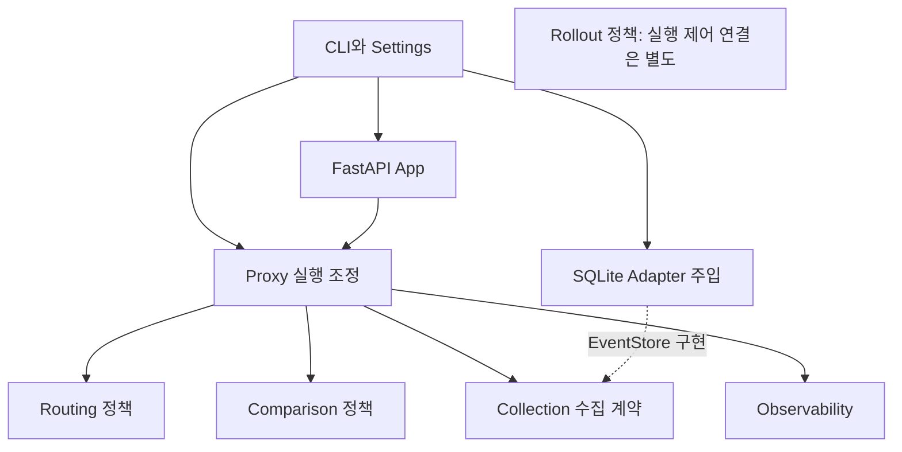

# FastAPI·Python 패키지·도메인 구조 비교

- 목적: FastAPI 애플리케이션의 패키지 구성과 도메인별 책임 분리 기준 조사
- 자료 확인일: 2026-09-28
- 적용 대상: Python/FastAPI 기반 API 전환 프록시
- 자료 성격: 기술 비교·검증 근거와 현재 코드에 적용한 구조 판단
- 기준: [기술 자료 적용과 검증](../_rules/technology-evaluation.md)

## 조사 결론

- FastAPI 사용 방식, Python 패키지 배치, 업무 책임 분리는 서로 다른 설계 축
- `src/{package}/` 내부에서도 도메인별 하위 패키지 구성 가능
- 공식 FastAPI 문서는 여러 파일과 router 조합을 설명하지만, 모든 프로젝트에 동일한 DDD 폴더 구조를 요구하지 않음
- 도메인별 패키지는 관련 정책·모델·처리를 함께 찾는 데 유용; 각 패키지를 독립 배포 서비스로 나눌 필요 없음
- DDD 적용 여부를 `domain`, `service`, `repository` 폴더 존재로 판단하지 않음
- 이 프로젝트의 특성: 일반 CRUD보다 원문 HTTP 전달·비동기 실행 수명·제한된 비교·수집이 중심

## 공식 문서·명세

| 자료 | 확인한 내용 | 적용 판단 |
| --- | --- | --- |
| [FastAPI: Bigger Applications](https://fastapi.tiangolo.com/tutorial/bigger-applications/) | Python package와 APIRouter로 관련 path operation을 분리·조합 | 관리용 HTTP endpoint 분리에 참고; 모든 도메인에 router가 있어야 한다는 근거 아님 |
| [FastAPI: Dependencies](https://fastapi.tiangolo.com/tutorial/dependencies/) | path operation에 필요한 공통 처리·권한·연결 등의 의존성 제공 | HTTP 진입의 인증·접근 검사에 적용; 순수 비교·배정 함수까지 Depends에 결합할 이유 없음 |
| [FastAPI: Lifespan](https://fastapi.tiangolo.com/advanced/events/) | 시작·종료 처리를 lifespan으로 관리하는 방식 권장 | 기존 app factory의 runtime 시작·종료 소유권 유지 |
| [PyPA: src layout vs flat layout](https://packaging.python.org/en/latest/discussions/src-layout-vs-flat-layout/) | import 대상 패키지를 src 아래에 분리하고 설치된 코드 사용을 유도 | 현재 설치·CLI·wheel 기반 흐름 유지와 양립; 도메인 디렉토리 추가를 막는 구조 아님 |
| [ASGI HTTP 명세](https://asgi.readthedocs.io/en/latest/specs/www.html) | raw path, query bytes, 중복 header, body message와 disconnect의 의미 | 중계기를 일반 JSON endpoint로 재작성하기 전에 보존해야 할 전달 계약 확인 |

- 위 자료의 구조 예시는 프로젝트 선택지이며 운영 성능·가용성 보장 근거가 아님
- 최신 문서와 저장소의 설치 버전은 다를 수 있음; 새 API 도입 시 실제 의존성 버전으로 재검증

## DDD·설계 자료

### Bounded Context

- DDD의 Bounded Context: 모델의 의미가 적용되는 범위와 다른 모델 사이 관계를 명확하게 하는 설계 개념
- 디렉토리 하나와 독립 Bounded Context 하나를 자동으로 동일시하지 않음
- 이 프로젝트의 routing·comparison·collection은 우선 하나의 프록시 내부 기능 Module로 해석 가능
- 독립 배포·별도 DB·메시지 통신의 도입은 조직·수명·일관성 요구가 있을 때 별도 판단
- 근거: [Martin Fowler: Bounded Context](https://martinfowler.com/bliki/BoundedContext.html)

### 도메인 정책과 저장 구현 분리

- 핵심 규칙이 저장 기술에 종속되지 않도록 의존성 방향을 관리하는 접근
- 저장 세부 사항을 감추는 작은 Interface는 실제 교체·테스트 필요가 있는 지점에 적용
- 현재 코드의 `EventStore.write_batch`와 SQLite 구현 분리가 직접적인 적용 후보
- 모든 모델에 범용 Repository·ORM·Unit of Work를 추가해야 한다는 의미 아님
- 근거: [Cosmic Python: Repository Pattern](https://www.cosmicpython.com/book/chapter_02_repository)

### 여러 기능을 연결하는 실행 조정

- HTTP 처리와 저장·정책 호출을 조정하는 절차를 구분하는 접근
- 핵심 정책과 실행 조정은 다른 책임; 조정 계층도 필요성이 확인된 부분에만 도입
- 프록시의 요청 실행·비교·마스킹·수집 연결은 실행 조정에 해당
- `compare()` 같은 순수 정책 함수와 queue·executor·collector를 사용하는 pipeline의 구분 필요
- 근거: [Cosmic Python: Service Layer](https://www.cosmicpython.com/book/chapter_04_service_layer)

## 실제 FastAPI 구성 사례

### 공식 Full Stack FastAPI Template

- 확인한 코드: 메인 app이 API router를 조합하고, API router가 users·items·login 등의 route를 조합
- 참고점: app 조립과 관련 endpoint 정의의 분리
- 한계: 업무 endpoint를 제공하는 템플릿; 원문 중계·응답 후 shadow 수명의 설계 근거로 그대로 적용할 수 없음
- 출처: [app/main.py](https://raw.githubusercontent.com/fastapi/full-stack-fastapi-template/master/backend/app/main.py), [app/api/main.py](https://raw.githubusercontent.com/fastapi/full-stack-fastapi-template/master/backend/app/api/main.py)

### FastAPI Best Practices 커뮤니티 사례

- 작성자의 다중 도메인 애플리케이션 경험을 바탕으로 도메인 아래 관련 파일을 모으는 구조 제안
- 참고점: 전역 routers/models/services 분류보다 기능 변경 위치를 가까이 두는 방식
- 한계: FastAPI 공식 표준이나 모든 서비스에 최적인 구조가 아님
- 이 프로젝트에서 불필요한 auth·ORM·migration·router 파일을 예시대로 생성하지 않음
- 출처: [zhanymkanov/fastapi-best-practices](https://github.com/zhanymkanov/fastapi-best-practices)

## 구조 대안 비교

| 대안 | 장점 | 비용·한계 | 적용 조건 |
| --- | --- | --- | --- |
| 기능별 단일 파일 | 작은 변경과 빠른 탐색에 단순 | 여러 책임이 커지면 파일 내부 탐색·변경 집중 | 책임이 작고 명확한 기능 |
| 전역 routers/models/services/repositories | 기술 역할을 쉽게 찾음 | 같은 기능 변경이 여러 폴더로 분산 | 작은 CRUD API 등 |
| 도메인·기능별 패키지 | 정책·모델·테스트의 소유권과 변경 위치 명확 | 패키지 간 의존성·공개 Interface 관리 필요 | 현재 프록시의 기능 증가에 비교적 적합 |
| 각 도메인에 동일한 4계층 DDD | 복잡한 업무 모델·여러 외부 Adapter 분리에 유리 | 빈 계층·전달 전용 wrapper·추상화 증가 가능 | 실제 업무 복잡도와 교체 요구가 있을 때 |
| 도메인별 마이크로서비스 | 독립 배포·확장·소유 가능 | 네트워크·장애·데이터 일관성·운영 부담 증가 | 별도 근거 필요; 현재 로컬 범위 밖 |

- 프로젝트 적용 판단: 패키징은 유지하고, 기능별 패키지 내부에서 실제 책임이 섞인 부분만 분리하는 방식 우선 검토
- 위 판단은 자료와 현재 프로젝트 특성을 대조한 해석; 외부 문서의 일괄 권고로 표현하지 않음

## 현재 코드와 대조할 기준

| 책임 | 유지할 부분 | 분리 검토 |
| --- | --- | --- |
| HTTP 진입 | app factory·lifespan·공개 Proxy와 관리 app 분리 | Prometheus 직렬화를 관측 Module로 이동 |
| 라우팅 | 안정된 cohort·불변 snapshot·목적지 제한 | 설정 파일 로딩과 route 정책 소유 구분 |
| 요청 실행 | ASGI body·disconnect·deadline·역할별 transport | shadow 선택과 실행 수명의 안전한 분리 가능성 |
| 비교 | 프레임워크 비의존 입력·정책·순수 비교 | 큐·executor·저장을 연결하는 pipeline과 구분 |
| 수집 | 제한 큐·부분 ACK·미확인 결과·허용 필드 | 이벤트 정책·collector·조회 계약·SQLite 분리 |
| 관측 | 유효 label·분모·비교 가능성 의미 | 메트릭 수집·품질 집계·표현 형식 분리 |
| 전환 관리 | gate·복귀·설정 전파의 증거 모델 | 정책 모델 존재와 실제 제어 기능 연결 구분 |

- 외부 API request/response를 Pydantic 모델로 재직렬화하는 방식의 구조 변경 제외
- collection·comparison 등 각 도메인에 HTTP endpoint·DB 모델을 기계적으로 추가하지 않음
- 동일 이름의 모델도 의미·필드·수명이 다르면 통합하지 않음
- 빈 shared/core/utils 패키지나 도메인 전체를 감싸는 범용 service 선행 생성 제외

## 현재 코드에 적용한 구조

- 단일 프록시 내부의 기능별 패키지 구성; 각 디렉토리를 독립 Bounded Context나 마이크로서비스로 선언하지 않음
- 기존 장점 유지: 불변 snapshot·정책 검증, 순수 비교 함수, 저장 Interface 주입, 명시적인 자원 제한·종료
- 개선 대상: 이벤트 보호 정책과 SQLite의 혼재, 관측 계산과 출력 형식의 혼재, CLI와 설정 파일 파싱의 혼재

| 위치 | 소유 책임 | 의존성 기준 |
| --- | --- | --- |
| `src/api_migration_proxy/routing/` | 설정 모델·revision 적용·route 매칭·serving 배정 | proxy 실행 Module 역참조 제외 |
| `src/api_migration_proxy/proxy/` | ASGI 요청 수명·HTTP transport·비교 및 수집 조정 | 여러 기능을 연결하는 application 역할 |
| `src/api_migration_proxy/comparison/` | 비교 입력·정책·순수 판정 | FastAPI·HTTPX·SQLite 의존 제외 |
| `src/api_migration_proxy/collection/` | 이벤트 보호·bounded collector·조회 계약·SQLite Adapter | collector는 `EventStore` 계약에 의존; SQLite 구현 역참조 제외 |
| `src/api_migration_proxy/observability/` | 메트릭·coverage 계산·Prometheus 출력 | runtime 역참조 제외 |
| `src/api_migration_proxy/rollout/` | gate·전환·복귀·전파 증거 정책 | 실행 제어와 구분되는 정책 Module |
| `app.py`, `cli.py`, `settings.py` | HTTP 진입·명령과 객체 조립·실행 설정 로딩 | 순수 도메인 정책에서 역참조 제외 |

- 테스트: 각 기능 패키지와 여러 기능을 연결하는 `tests/integration/`으로 구분
- 유지 계약: CLI entrypoint·설정 JSON·HTTP request/response·SQLite schema
- 내부 Python import 경로 변경: 기존 flat Module을 직접 import하는 외부 코드가 있다면 새 위치로 갱신 필요
- 미연결 기능 유지: rollout 정책·worker 품질 집계·관리 app의 존재가 기본 CLI의 동적 전환 제어 구현을 의미하지 않음

### 남긴 결합과 추가 분리 조건

- `proxy/runtime.py`: ASGI·serving·shadow의 수명 조정을 함께 유지; mutable 상태와 취소 책임이 더 분산되는 추출은 보류
- `routing/configuration.py`: route·shadow·snapshot의 원자적 검증과 snapshot 파일 로더를 함께 유지; 파일 I/O가 남아 있으므로 순수 domain 계층 전체로 표현하지 않음
- `collection` 내부: 이벤트 모델·collector 계약·SQLite 간 직접 참조 유지; 범용 repository나 공유 helper 계층 선행 추가 제외
- `cli.py`: 작은 객체 조립 유지; 복수 진입점의 조립 중복이 발생할 때 별도 bootstrap 검토
- DDD의 Entity·Aggregate·Domain Event는 필요한 정체성·불변 조건·업무 사건이 있을 때 적용; 관측용 수집 이벤트를 자동으로 Domain Event와 동일시하지 않음

## 구조 변경 검증 기준

- 기존 CLI 명령·설정 JSON·HTTP·저장 schema 계약 유지
- 순수 정책 Module의 FastAPI·HTTPX·SQLite 역의존 여부 확인
- 패키지 초기화의 eager import와 순환 의존 확인
- 테스트 import·monkeypatch가 실제 실행 대상을 가리키는지 확인
- wheel 설치·Docker 이미지에서 이동한 패키지 포함 여부 확인
- 제품 Docker 이미지에서 CLI 기동·응답 전환·오류 전달·이벤트 보존 회귀 검증
- 코드 이동을 새 기능 연결·운영 준비 완료로 보고하지 않음

## 관련 기획

- [제품 도메인과 책임](../product/overview.md)
- [HTTP 전달 계약](../routing/http-forwarding.md)
- [Shadow 수명·제한](../shadow/lifecycle-and-limits.md)
- [이벤트 수집·저장](../collection/async-storage.md)
- [로컬 실행·운영 경계](../infrastructure/deployment-and-stack.md)
