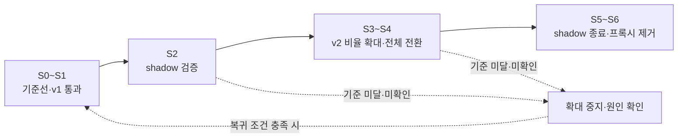

# 전환 관리

관측 증거를 바탕으로 비율을 확대하고 문제 발생 시 중지·복귀하며 최종 종료를 관리한다.

단계 확대는 검증 증거를 확인한 수동 판단으로 진행하며, 미확인 조건이 있으면 보류한다. v1 복귀에는 데이터·권한·용량 준비가 필요하고, 전체 v2 전환 뒤에도 shadow 종료와 직접 연결을 별도로 확인한다.

## 기능별 문서

| 기능 | 상세 범위 |
| --- | --- |
| [단계·승격 기준](stages-and-gates.md) | S0~S6, 준비 목록과 G-01~G-08 |
| [변경 적용·이력](change-management.md) | 변경 절차, 적용 결과와 epoch 기록 |
| [중지·롤백·우회](rollback-and-bypass.md) | 장애별 조치와 v1 복귀 가능한 조건 |
| [종료·프록시 제거](retirement.md) | 잔존 v1 의존, 직접 연결과 보존 종료 |

[전체 도메인](../README.md)
