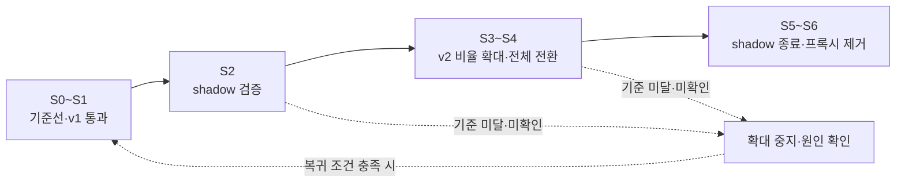

# 전환 관리

이 문서는 등록 route 또는 동일한 배정 정책을 공유하는 cohort group의 전환을 관리한다. 이 문서 모음의 변경 담당자는 전환 설정 변경을 맡은 [마이그레이션 담당자](../product/overview.md#사용자와-책임)를 뜻한다. 변경 담당자는 관측 증거를 검토하여 v2 serving 비율을 유지하거나 확대한다. 중지 조건에 해당하면 shadow 중지, v1 serving 복귀, 프록시 우회 중 장애 원인에 맞는 조치를 선택한다.

Stage는 마이그레이션의 운영 단계이고, epoch는 동일한 설정과 관측 조건으로 결과를 해석하는 구간이다. 그 밖의 용어는 [공통 용어](../_rules/glossary.md)를 따른다. 배포 완료, 다음 stage로의 승격, 마이그레이션 종료는 서로 다른 판정이다.

## 판단과 실행의 책임

단계 확대는 변경 담당자가 증거를 확인한 뒤 수동으로 판단한다. 적용 대상인 필수 gate 중 하나라도 `fail` 또는 `unknown`이면 확대해서는 안 된다. 목표 수치·표본·관측 기간이 정해지지 않았거나 측정 근거가 없으면 `unknown`으로 처리해야 한다.

전환 정책 모듈은 입력된 gate 증거, 설정 적용 보고, 복귀·종료 확인 항목을 평가한다. 이 평가를 설정 배포, 인스턴스 상태의 자동 수집 또는 장애 복구의 실행으로 간주해서는 안 된다. 실제 설정 적용과 복구는 [변경 적용 절차](change-management.md) 및 기존 운영 절차에 따라 수행한다.

## 전환 진행 순서

변경 담당자는 다음 절차를 수행하십시오.

1. 대상 route 또는 cohort group의 현재 stage·revision·epoch를 확인하십시오.
2. [단계·승격 기준](stages-and-gates.md)에 따라 다음 단계의 증거를 평가하십시오.
   적용 대상인 필수 조건을 모두 충족한 경우에만 확대 변경을 선택하십시오.
3. 선택한 변경을 [변경 적용·이력](change-management.md)에 따라 적용하십시오.
4. 변경 요청과 실제 적용 결과를 별도로 기록하십시오.
5. 적용 후 사용자 품질·비교·수집·자원 상태를 관측하십시오.
   중지 조건에 해당하거나 필수 관측이 미확인이면 확대를 중지하십시오.
   중지 후 조치는 [중지·롤백·우회](rollback-and-bypass.md)에 따라 판단하십시오.
6. 대상의 전체 v2 serving이 확인되면 [종료·프록시 제거](retirement.md)에 따라 각 종료 결과를 판정하십시오.
   Shadow 종료, v1 사용 종료, 프록시 제거, 관측 기록 정리는 각각 별도의 결과이다.

v1 복귀에는 현재의 데이터·권한·계약·용량·경로 준비가 필요하다. 과거에 v1이 동작했거나 현재 v1 shadow가 실행된다는 사실만으로 복귀 가능 상태를 표시해서는 안 된다. 전체 v2 serving 이후에도 직접 v2 연결과 잔존 v1 의존을 확인하기 전에는 전체 종료를 선언해서는 안 된다.

```mermaid
flowchart LR
    A["S0~S1<br/>기준선·v1 통과"] --> B["S2<br/>shadow 검증"]
    B --> C["S3~S4<br/>v2 비율 확대·전체 전환"]
    C --> D["S5~S6<br/>shadow 종료·프록시 제거"]
    B -. "기준 미달·미확인" .-> E["확대 중지·원인 확인"]
    C -. "기준 미달·미확인" .-> E
    E -. "복귀 조건 충족 시" .-> A
```

이 흐름도의 복귀 화살표는 v1 복귀 조건을 확인한 경우의 경로이다. 장애가 발생하면 조건 확인 없이 v1으로 자동 복귀한다는 의미가 아니다.

## 기능별 문서

| 기능 | 상세 범위 |
| --- | --- |
| [단계·승격 기준](stages-and-gates.md) | S0~S6의 상태, 첫 대상의 준비 항목, G-01~G-08의 판단 절차 |
| [변경 적용·이력](change-management.md) | 변경 요청, 설정 전파, 실제 적용 확인, epoch와 변경 결과 기록 |
| [중지·롤백·우회](rollback-and-bypass.md) | 장애별 조치 선택, v1 복귀 조건, 조치 완료와 미확인 결과의 구분 |
| [종료·프록시 제거](retirement.md) | 잔존 v1 의존 확인, 직접 v2 연결, 결과별 종료와 보존 만료 |

[전체 도메인](../README.md)
