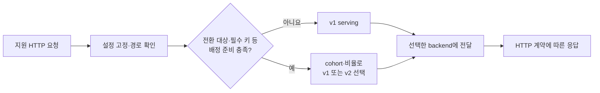

# 요청 라우팅

대상 API를 식별하고 사용자 응답 backend를 선택하며 HTTP 계약과 설정 일관성을 유지한다.

요청마다 설정을 고정하고 경로·cohort·전환 비율로 serving을 선택한다. 양쪽 실행 속도나 비교 결과로 이미 선택한 사용자 응답을 바꾸지 않는다.

## 기능별 문서

| 기능 | 상세 범위 |
| --- | --- |
| [경로 등록](route-registration.md) | route, 목적지와 미등록·미지원 경로 처리 |
| [응답 선택과 cohort](serving-and-cohorts.md) | v1 통과, v2 비율, 사용자·그룹 배정 |
| [HTTP 전달](http-forwarding.md) | 요청·응답·헤더·본문과 전송 오류 계약 |
| [설정 검증·적용](configuration.md) | revision, 활성화 조건과 적용 충돌 |

관련 기술 자료는 [프록시·검증 도구 비교](../research/proxy-patterns-and-tools.md)에 정리한다.

[전체 도메인](../README.md)
