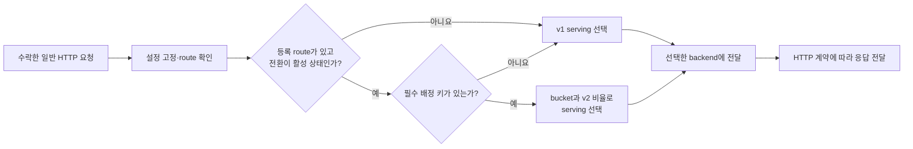

# 요청 라우팅

프록시는 호출자의 요청에 적용할 등록 API 단위인 route를 찾고, 그 요청의 사용자 응답을 제공할 backend를 한 번 선택한다. 사용자 응답을 제공하는 역할을 serving이라고 한다. v1과 v2 중 어느 쪽도 serving이 될 수 있다. 용어의 공통 정의는 [공통 용어](../_rules/glossary.md)를 따른다.

프록시는 요청을 수락할 때 유효한 설정 스냅샷을 고정한다. 이후 해당 요청의 경로, 목적지, 전환 비율과 cohort 배정에는 같은 스냅샷을 사용한다. 요청 처리 중 새 설정이 반영되어도 이미 선택한 serving을 바꾸지 않는다. 반대편 backend의 응답 속도나 비교 결과도 serving 변경 사유가 아니다.

## 요청별 처리 흐름

아래 흐름은 유효한 설정이 있고 serving 동시 실행 한도 안에서 수락한 일반 HTTP 요청에 적용한다. 지원 여부가 검증되지 않은 프로토콜의 진입 경로는 [경로 등록](route-registration.md)에서 별도로 정한다.

1. 프록시는 요청의 method와 path를 등록된 route의 method와 path template에 대조한다.
2. 일치하는 route가 없으면 설정의 기본 v1을 serving으로 선택하고 5단계로 진행한다. 일치하는 route가 있으면 3단계로 진행한다.
3. route의 전환이 비활성 상태이면 그 route의 v1을 선택하고 5단계로 진행한다. 전환이 활성 상태이면 4단계로 진행한다.
4. [cohort 배정 조건](serving-and-cohorts.md)에 따라 serving을 선택한다. 필수 키가 없으면 v1을 선택한다. 키가 있으면 bucket과 v2 비율을 비교하여 v1 또는 v2를 선택한다.
5. 프록시는 선택한 serving에 요청을 전달하고 그 응답을 호출자에게 전달한다. 요청·응답의 보존 항목과 전달 실패 처리는 [HTTP 전달 계약](http-forwarding.md)을 따른다.

1~4단계에서 serving 선택이 끝나면 [shadow 실행 조건](../shadow/eligibility-and-sampling.md)을 판단한다. shadow 실행과 5단계의 serving 전달은 별도 흐름으로 진행한다. shadow 선택·실행의 성공 여부는 serving 선택을 다시 수행하게 하지 않는다.

```mermaid
flowchart LR
    A["수락한 일반 HTTP 요청"] --> B["설정 고정·route 확인"]
    B --> C{"등록 route가 있고<br/>전환이 활성 상태인가?"}
    C -- "아니요" --> D["v1 serving 선택"]
    C -- "예" --> E{"필수 배정 키가 있는가?"}
    E -- "아니요" --> D
    E -- "예" --> F["bucket과 v2 비율로<br/>serving 선택"]
    D --> G["선택한 backend에 전달"]
    F --> G
    G --> H["HTTP 계약에 따라 응답 전달"]
```

## 기능별 문서

| 기능 | 확인할 내용 |
| --- | --- |
| [경로 등록](route-registration.md) | route 등록 조건, 고정 목적지, 미등록 경로와 미지원 프로토콜의 처리 책임 |
| [응답 선택과 cohort](serving-and-cohorts.md) | 배정 키 확인, v1 통과 조건, bucket 경계값, 연관 route의 배정 일관성 |
| [HTTP 전달](http-forwarding.md) | 요청·응답 보존 항목과 headers 전송 전후의 실패 처리 |
| [설정 검증·적용](configuration.md) | 스냅샷 검증, revision 충돌, 적용 실패와 worker별 완료 판정 |

프록시·검증 도구를 검토할 때에는 [도구 비교](../research/proxy-patterns-and-tools.md)를 참고한다. 도구의 기능이 존재한다는 사실만으로 이 문서의 전달·배정 계약을 충족했다고 판정해서는 안 된다.

[전체 도메인](../README.md)
