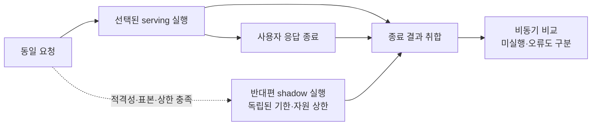

# Shadow 실행

복제 가능한 요청을 선택해 반대편 API도 실행하고 사용자 응답과 수명·자원을 분리한다.

serving이 v1이면 shadow는 v2, serving이 v2이면 shadow는 v1이다. 사용자 응답은 shadow를 기다리지 않으며, 양쪽 실행과 사용자 응답이 종료된 뒤 비교 작업으로 넘긴다.

## 기능별 문서

| 기능 | 상세 범위 |
| --- | --- |
| [복제 적격성과 표본](eligibility-and-sampling.md) | 실제 부작용 확인, 독립적인 shadow 선택 |
| [양쪽 실행](parallel-execution.md) | 입력 복제, 병렬 흐름과 선택 응답 유지 |
| [수명·취소·상한](lifecycle-and-limits.md) | timeout, client 취소, 종료와 자원 한도 |

[전체 도메인](../README.md)
