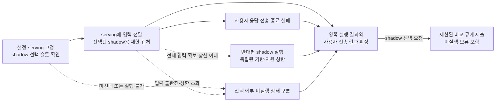

# Shadow 실행

shadow는 한 논리 요청을 사용자 응답으로 선택되지 않은 반대편 backend에도 실행하는 역할이다. serving이 v1이면 shadow는 v2이고, serving이 v2이면 shadow는 v1이다. shadow의 응답이 먼저 도착하거나 성공하더라도 사용자 응답으로 선택하지 않는다. 공통 용어는 [용어 정의](../_rules/glossary.md)를 따른다.

## 실행과 종료의 구분

프록시는 [serving 배정](../routing/serving-and-cohorts.md)을 고정한 뒤 shadow 적격성과 표본 선택을 판단한다. 표본으로 선택했어도 실행 슬롯이 없거나 요청 복제 상한을 넘으면 shadow를 실행하지 않는다. 이 경우에는 선택한 사실과 실행하지 못한 결과를 구분하여 유지한다.

프록시는 serving에 요청 body를 전달하면서 shadow용 입력을 정해진 상한 안에서 복사한다. 전체 입력이 완전히 수신되었고 상한을 넘지 않았을 때 shadow를 시작한다. serving 시작을 전체 입력 확보까지 지연하지 않으며, shadow 시작을 serving 응답 완료에 맞추지 않는다. 입력을 완전히 확보하지 못한 경우에는 shadow를 실행하지 않는다. 입력 확보와 실행 시작의 정확한 순서는 [양쪽 실행 절차](parallel-execution.md)를 따른다.

사용자 응답은 serving에서 받은 내용을 기준으로 전달하며 shadow·비교·저장 완료를 기다리지 않는다. 비교 제출에는 serving의 종료 또는 미실행, shadow의 종료 또는 미실행, 사용자 전송 결과가 모두 필요하다. shadow가 먼저 끝났다는 사실만으로 양쪽 결과를 조기에 확정해서는 안 된다.

아래 도식은 요청 전달을 시작할 수 있는 경우의 흐름이다. 업로드 중 조기 응답·timeout·취소로 입력이 불완전해지는 분기는 [입력 복제 절차](parallel-execution.md)를 따른다.

```mermaid
flowchart LR
    A["설정·serving 고정<br/>shadow 선택·슬롯 확인"] --> B["serving에 입력 전달<br/>선택된 shadow용 제한 캡처"]
    B --> C["사용자 응답 전송 종료·실패"]
    B -. "전체 입력 확보·상한 이내" .-> D["반대편 shadow 실행<br/>독립된 기한·자원 상한"]
    A -. "미선택 또는 실행 불가" .-> G["선택 여부·미실행 상태 구분"]
    B -. "입력 불완전·상한 초과" .-> G
    B --> E["양쪽 실행 결과와<br/>사용자 전송 결과 확정"]
    C --> E
    D --> E
    G --> E
    E -- "shadow 선택 요청" --> F["제한된 비교 큐에 제출<br/>미실행·오류 포함"]
```

## 기능별 문서

| 기능 | 확인할 내용 |
| --- | --- |
| [복제 적격성과 표본](eligibility-and-sampling.md) | API 효과 검토, 적격 조건, 표본 선택과 E·S 분모의 구분 |
| [양쪽 실행](parallel-execution.md) | 입력 복제의 성공·초과 분기, 병렬 실행, 사용자 응답과 비교 제출의 완료 조건 |
| [수명·취소·상한](lifecycle-and-limits.md) | timeout·client 취소·정상 완료의 구분, 자원 회수와 종료 예산 |

[전체 도메인](../README.md)
