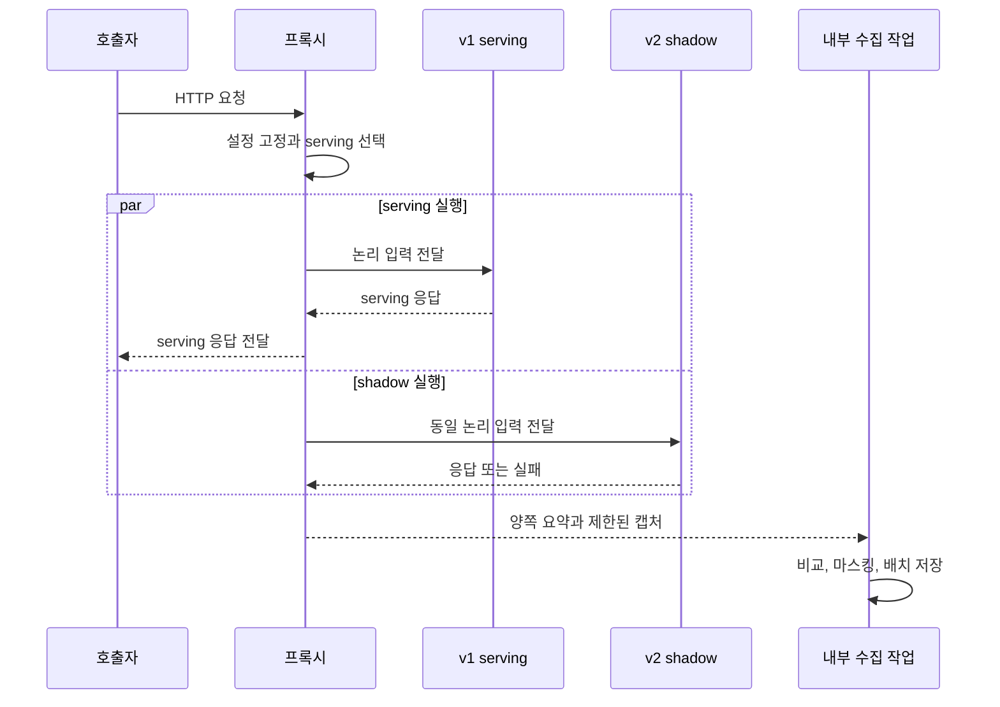

# 양쪽 API 실행과 응답 경로 분리

- 목적: 동일 논리 요청의 독립 실행 및 사용자 응답과 shadow·비교·저장 대기의 분리

## 기능 계약

| 항목 | 정의 |
| --- | --- |
| 시작 조건·입력 | 고정된 serving, 선택된 shadow, 동일 논리 입력과 역할별 실행 예산 |
| 결과·출력 | 사용자 응답과 독립적인 v1/v2 실행 종료 결과 |
| 실패·제한 | 자동 retry·fallback 기본 비활성; body 소모·입력 변조·빠른 응답에 따른 serving 변경 금지 |

## 요청 처리 순서

1. 요청 도착 시 내부 logical request ID·단조 증가 시계 측정 시작점 생성; 외부 ID의 이벤트 고유 키 사용 금지
2. 유효한 설정 스냅샷으로 route·목적지·인증 문맥·지원 범위 결정
3. 전환 비활성·필수 cohort 키 누락 처리 후 serving 단일 선택
4. serving 실행 및 shadow 적격성·표본·동시 실행·본문 제한 확인; 허용된 반대편 요청의 병렬 실행
5. 준비된 serving 응답 즉시 전달; 비교용 전체 캡처·shadow 완료 대기 금지
6. 각 실행의 status·지연·크기·오류 갱신 및 상한 내 비교 캡처 유지
7. serving backend 종료, shadow 종료 또는 미실행, 사용자 응답 전송 종료·실패를 모두 확정한 뒤 제한된 비교 큐에 작업 제출; 제출 실패 계측
8. 정책에 따른 비교 판정·마스킹 및 요약 이벤트 배치 저장; 사용자 응답과 독립적인 저장 성공·실패 관측

- shadow deadline 도달: shadow의 종료 사유 확정; 진행 중 serving의 중단·조기 결과 확정 금지
- shadow 미선택: 실행 메트릭 유지; 상세 수집 대상으로 임의 확대 금지
- shadow 선택 후 미실행: 사유와 선택 분모 보존; serving backend와 사용자 응답 전송 종료 후 미실행 요약 생성
- backend 수신 완료와 사용자 전송 완료: 별도 상태로 관리; 사용자 종료 결과를 확보한 뒤 최종 요약 확정, 사용자 응답의 비교·저장 대기 금지
- 모든 결과 대기: 역할별 최대 수명 안에서 제한; 강제 종료 시 유실 가능성은 별도 기록
- 도구의 기본 mirroring 채택 시: shadow 응답의 수집 가능 여부 확인; 응답을 폐기하는 기능만으로 위 비교 흐름 충족 판정 금지
- 실행 책임: 기존 gateway·mesh와 프록시의 중복 mirroring 방지; 실제 경로 전체의 backend별 실행 횟수 확인
- 응답 후 작업 등록 기능: 요청 시점의 양쪽 실행과 구분; shadow 호출 전체를 응답 후에 시작하는 구현은 현재 병렬 실행 계약과 불일치
- 구현 고려사항: [프록시 도구](../research/proxy-patterns-and-tools.md), [FastAPI·Starlette 실행 시점](../research/service-options-and-constraints.md)

## 입력 복제와 캡처

- 작은 body 복제: 상한 내 1회 읽기 후 각 실행에 독립 reader 제공
- 가변 입력: 헤더·버퍼의 동시 수정·공유 reader 소비 금지
- 호출자 상태: 같은 요청의 허용된 cookie·인증·tenant 문맥만 양쪽에 전달; 공유 HTTP client의 이전 쿠키·인증 상태나 shadow 응답으로 입력을 변경하지 않음
- 사용자 지연: body 확보·계측·캡처 비용의 부하 시험 측정; 추가 지연 0 가정 금지
- 복제 상한 초과: 추가 복제 버퍼 확장 중지, shadow 생략, 지원 범위 안의 serving 전달 유지
- 길이 미상 body: 이미 읽은 prefix와 남은 입력을 합쳐 serving에 손실·중복 없이 전달
- 압축 입력: 전달 바이트 상한 적용 및 비교용 해제 수행 시 해제 바이트 상한 별도 적용; serving 입력 변경 금지
- HTTP 계약 검증: 복제 상한·청크 수신 경계·압축 여부와 관계없이 serving body 바이트·헤더 의미 보존

## 기본 시퀀스

- v2 serving: 역할만 반대이며 동일 처리 규칙 적용
- shadow 선행 완료: 선택된 serving 응답 유지
- 사용자 경로 영향: 메트릭 갱신·캡처 비용을 포함한 부하 시험으로 검증

## 요구사항과 수용 조건

| ID | 우선순위 | 요구사항 | 수용 조건 |
| --- | --- | --- | --- |
| FR-11 | P0 | 같은 논리 입력을 독립 실행 | body reader·가변 헤더 공유로 한쪽 입력이 소모·오염되지 않음 |
| FR-12 | P0 | 사용자 응답과 shadow·비교·저장 대기 분리 | 느린 shadow나 저장소 정지가 serving 응답 완료를 기다리게 하지 않음 |
| FR-15 | P0 | 자동 retry·fallback 기본 비활성 | 프록시의 application-level backend attempt는 백엔드당 최대 한 번 |

## 검증 계획

- 구현 후 검증: [T-04, T-09, T-12, T-13, T-14, T-15, T-17, T-29, T-43](../validation/test-catalog.md)

## 관련 기능

- [HTTP 계약](../routing/http-forwarding.md)
- [수명과 자원 제한](lifecycle-and-limits.md)
- [결과 수집](../collection/event-model.md)
