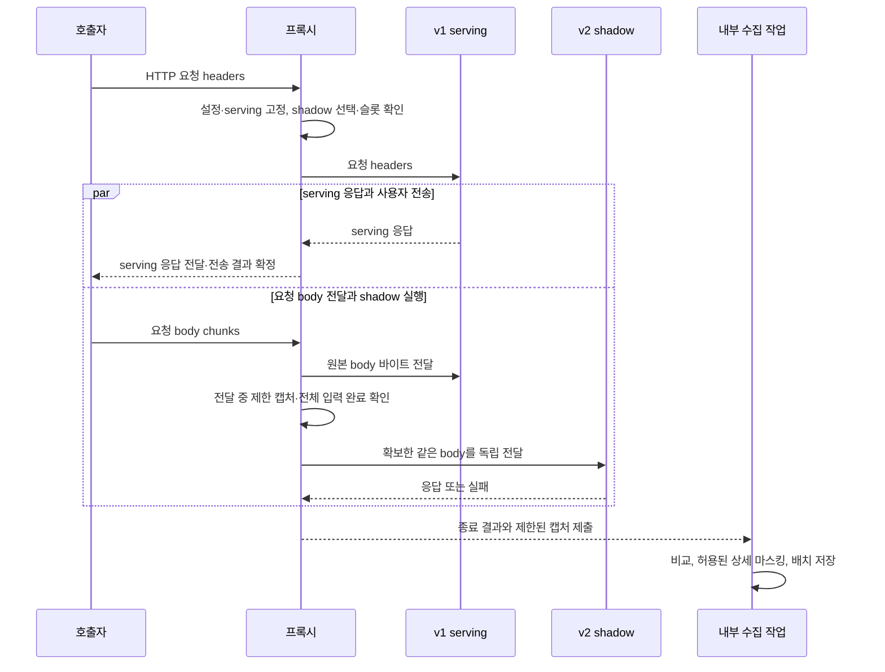

# 양쪽 API 실행과 응답 경로 분리

프록시는 하나의 논리 요청을 serving과 실행 조건을 충족한 shadow에 독립적으로 전달한다. 논리 요청은 호출자가 보낸 요청 한 건이고, backend attempt는 그 요청을 특정 backend에 실행하는 한 번의 시도이다. 사용자 응답 전달은 shadow·비교·저장 완료와 독립적으로 진행한다.

## 기능 계약

| 항목 | 정의 |
| --- | --- |
| 시작 조건·입력 | 요청에 고정된 설정과 serving, shadow 선택 결과, 동일 논리 입력과 역할별 실행 예산을 사용한다. |
| 결과·출력 | 프록시는 serving 응답을 호출자에게 전달하고, 양쪽 실행·미실행 결과와 사용자 전송 결과를 별도로 확정한다. |
| 실패·제한 | 프록시의 application-level 자동 retry·fallback은 비활성이다. reader 공유로 입력을 소모하거나, body를 변경하거나, 더 빠른 응답으로 serving을 바꾸어서는 안 된다. |

## 요청 처리 순서

아래 순서는 설정과 serving 동시 실행 한도 검사를 통과하여 수락한 요청에 적용한다. serving에는 수신한 입력을 바로 전달한다. shadow는 전달 중 복사한 전체 입력을 확보한 뒤 실행하며 serving 응답 완료를 기다리지 않는다.

### 입력 준비

1. 프록시는 내부 logical request ID를 생성한다. 호출자가 보낸 외부 ID를 이벤트의 고유 키로 사용하지 않는다.
2. 프록시는 요청 시작 시각과 단조 증가 시계의 측정 시작점을 기록한다.
3. 프록시는 고정한 설정 스냅샷으로 route와 목적지를 찾는다.
4. 프록시는 신뢰할 수 있는 인증·배정 문맥으로 [serving 배정 절차](../routing/serving-and-cohorts.md)를 수행한다. 결과는 serving backend 하나이다.
5. 프록시는 [shadow 적격성·표본 절차](eligibility-and-sampling.md)를 수행한다. 미선택이면 body 복제 없이 serving 전달로 진행한다. 선택이면 6단계로 진행한다.
6. 프록시는 shadow 실행 슬롯을 확인한다. 슬롯이 없으면 shadow를 생략하고 serving 전달로 진행한다. 슬롯을 확보하면 7단계로 진행한다.
7. 프록시는 serving에 요청 body를 전달하면서 수신 chunk를 shadow용으로 복사한다. 각 chunk마다 복제 상한을 검사하며, 전체 입력을 완전히 확보한 경우에만 shadow를 시작한다. 성공·상한 초과·실패 분기는 아래 [입력 복제와 캡처](#입력-복제와-캡처)를 따른다.

### 병렬 실행과 사용자 전송

프록시는 serving의 요청 송신과 응답 수신을 함께 진행한다. shadow는 완전한 입력 확보라는 시작 조건을 충족한 뒤 독립적으로 진행한다. 두 backend의 응답 완료 순서는 고정하지 않는다.

| 흐름 | 동작 |
| --- | --- |
| serving 실행 | 선택한 backend에 수신 body 바이트를 전달한다. 전체 body 확보나 shadow 결과를 먼저 기다리지 않는다. |
| shadow 실행 | 전체 입력을 복제 상한 안에서 확보하면 반대편 backend에 요청을 전달한다. 확보한 같은 body를 독립 reader로 읽는다. |
| 사용자 전송 | serving의 headers·body를 받는 대로 [HTTP 전달 계약](../routing/http-forwarding.md)에 따라 전송한다. 비교용 전체 캡처나 shadow 완료를 기다리지 않는다. |
| 실행 관측 | 각 backend의 status·지연·수신 bytes·오류와 비교용 캡처 상태를 갱신한다. |

### 결과 확정과 비교 제출

1. 사용자 전송이 완료·실패·취소로 끝나면 프록시는 사용자 전송 결과를 확정한다. 정상 완료 뒤의 기존 shadow는 자신의 기한까지 계속할 수 있다. 취소와 timeout은 [수명 규칙](lifecycle-and-limits.md)을 따른다.
2. shadow 선택 요청이면 프록시는 아래 세 종료 조건을 확인한다. 세 조건이 모두 확정되기 전에는 비교 큐에 제출하지 않는다.

   | 종료 조건 | 확인할 상태 |
   | --- | --- |
   | serving 실행 | backend 실행이 완료·실패·취소로 끝났거나 실행되지 않은 상태가 확정되었는가? |
   | shadow 실행 | backend 실행 종료 또는 미실행이 확정되었는가? |
   | 사용자 전송 | 전송 완료·실패·취소가 확정되었는가? |

3. 세 조건이 모두 확정되면 프록시는 제한된 비교 큐에 결과를 제출한다. 제출을 수락하지 못하면 드롭을 계측한다.
4. 수락된 비교 작업은 비교 정책에 따라 판정한다.
5. 상세 수집 조건을 충족한 작업은 허용된 상세 필드를 마스킹한다. 조건을 충족하지 않으면 상세 수집을 생략한다.
6. 수집 작업은 요약과 선택된 상세를 배치로 저장한다. 저장 성공·실패는 사용자 응답과 독립적으로 관측한다.

비교·상세·저장 작업의 결과가 이미 결정한 사용자 응답을 변경해서는 안 된다.

shadow를 선택하지 않은 요청도 serving 실행 메트릭은 유지한다. 다만 shadow 미선택 요청을 비교 이벤트나 상세 수집 대상으로 임의 확대하지 않는다.

## 입력 복제와 캡처

body reader는 body 바이트를 순서대로 읽는 소비 경로이다. 프록시는 serving에 전달하는 입력을 제한된 버퍼에 복사하고, 입력이 완전히 확보되면 shadow에 별도 reader로 전달한다. 양쪽 실행이 하나의 reader를 함께 소비하면 한쪽이 읽은 바이트를 다른 쪽이 받지 못할 수 있으므로 공유해서는 안 된다. 동시에 변경되는 헤더·버퍼를 양쪽 입력으로 사용해서도 안 된다.

| 판정 시점·조건 | serving 처리 | shadow 처리 |
| --- | --- | --- |
| shadow 미선택 | 원래 요청 body를 전달한다. | 요청 body 복제와 shadow 실행을 수행하지 않는다. |
| shadow 선택 후 실행 슬롯 없음 | 원래 요청 body 전달을 계속한다. | 실행을 생략하고 `slot_exhausted`를 기록한다. 무제한 대기열에 넣지 않는다. |
| 슬롯 확보 후 전체 body가 복제 상한 이하로 수신됨 | 수신 중인 body를 계속 전달한다. 전체 body가 모일 때까지 전달을 늦추지 않는다. | 입력 완료 뒤 같은 body를 별도 reader로 전달한다. 정확히 상한 크기인 body는 이 경우에 포함한다. |
| body를 읽던 중 누적 bytes가 복제 상한보다 커짐 | 수신 chunk와 남은 입력을 계속 전달한다. 손실·중복이 생겨서는 안 된다. | 복사한 입력을 비우고 추가 복제를 중단한다. 실행을 생략하며 `request_oversized`를 기록한다. |
| 복제 상한 이내에서 backend 조기 응답이 완료되어 업로드가 끝나기 전에 입력 수신이 중단됨 | backend의 status·body·전달 대상 헤더를 보존한다. | 전체 입력을 확보하지 못했으면 실행하지 않는다. `capture_unavailable`로 미실행 사유를 남긴다. |
| body 전달 중 timeout 또는 호출자 취소가 발생함 | 해당 실패·취소를 [수명 규칙](lifecycle-and-limits.md)에 따라 처리한다. body를 완전히 확보한 것으로 처리하지 않는다. | 아직 실행하지 않은 shadow를 실행 완료로 기록해서는 안 된다. 선택한 사실과 미실행 상태를 유지한다. |

길이를 미리 알 수 없는 body도 실제 수신 bytes로 같은 상한을 적용한다. 상한은 shadow용 복사본을 제한하며 serving 전달 바이트를 자르지 않는다. 상한을 넘긴 chunk도 serving에 그대로 전달한다. 이미 전달한 입력을 다시 읽거나 전송해서는 안 되며, 복제 상한 초과만으로 지원 범위 안의 serving 요청을 오류로 바꾸어서도 안 된다.

요청을 양쪽에 보낼 때에는 같은 요청의 허용된 cookie·인증·tenant 문맥만 전달한다. 공유 HTTP client의 이전 cookie·인증 상태나 shadow 응답으로 입력을 변경해서는 안 된다.

압축된 입력은 전달 바이트의 상한을 적용한다. 비교를 위해 압축 해제를 수행한다면 해제 바이트에도 별도 상한을 적용해야 하며, 해제한 데이터로 serving 입력을 대체해서는 안 된다. 복제 상한, 청크 수신 경계와 압축 여부가 달라도 serving이 받은 body 바이트와 헤더 의미가 원래 계약과 일치해야 한다.

body 확보·복사·계측·캡처에는 비용이 든다. 운영 검증에서는 이 비용을 포함한 사용자 지연과 메모리를 측정해야 한다. 병렬 실행이라는 이유로 추가 지연을 0으로 가정해서는 안 된다.

## 종료 결과와 비교 제출

| 확인된 상태 | 허용되는 처리 | 해서는 안 되는 처리 |
| --- | --- | --- |
| shadow가 먼저 timeout·오류·완료로 끝났고 serving은 진행 중임 | shadow 결과만 확정하고 serving을 계속 처리한다. | 양쪽이 모두 종료되었다고 판정하거나 serving을 조기에 중단해서는 안 된다. |
| serving backend가 body 수신을 끝냈지만 호출자 전송은 진행 중임 | backend 수신 완료와 사용자 전송 진행 상태를 각각 유지한다. | backend 수신 완료만으로 최종 사용자 전송 결과를 확정해서는 안 된다. |
| 사용자 전송은 정상 완료했고 shadow가 진행 중임 | 사용자 요청은 완료 상태로 두고 기존 shadow를 자신의 기한까지 유지한다. | shadow가 끝날 때까지 사용자 응답을 기다리게 해서는 안 된다. 정상 사용자 전송 완료를 client 취소로 처리해서도 안 된다. |
| shadow를 선택했지만 실행하지 않았음 | serving의 종료 또는 미실행과 사용자 전송 결과가 확정되면 비교 작업에 넘길 수 있다. 선택 분모와 미실행 상태를 유지한다. | 해당 요청을 shadow 미선택으로 바꾸어 선택 분모에서 제외해서는 안 된다. |
| 세 종료 조건이 모두 확정됨 | 비교 큐의 개수·bytes·age 예산 안에서 작업을 제출한다. | 저장 완료까지 사용자 응답을 붙잡아 두어서는 안 된다. |

결과를 기다리는 시간은 역할별 실행·전송·정리 예산으로 제한해야 한다. 프로세스 강제 종료로 결과가 유실될 수 있으므로, 확인하지 못한 결과를 정상 완료로 채워서는 안 된다.

기존 gateway·mesh에서 mirroring을 사용하는 경우에는 운영자가 전체 경로의 backend별 실행 횟수를 확인해야 한다. 같은 요청을 gateway와 프록시가 각각 복제하여 중복 실행하게 해서는 안 된다. 응답을 폐기하는 mirror 기능만으로 비교에 필요한 양쪽 응답을 수집한다고 판정해서도 안 된다.

응답 후 작업 등록 기능은 비교·저장 작업의 분리에 사용할 수 있다. shadow의 시작 조건은 상한 안에서 전체 입력을 확보한 상태이며, 사용자 응답 완료를 기다리는 조건이 아니다. 관련 기술 범위는 [프록시 도구](../research/proxy-patterns-and-tools.md)와 [FastAPI·Starlette 실행 시점](../research/service-options-and-constraints.md)를 참고한다.

## 기본 시퀀스

아래 시퀀스는 shadow를 선택했고 슬롯·body 조건도 충족한 경우이다. 두 backend의 응답 순서는 고정하지 않는다. 비교 큐 제출은 양쪽 실행 결과와 사용자 전송 결과가 모두 확정된 뒤에만 수행한다.

```mermaid
sequenceDiagram
    participant C as 호출자
    participant P as 프록시
    participant A as v1 serving
    participant B as v2 shadow
    participant Q as 내부 수집 작업
    C->>P: HTTP 요청 headers
    P->>P: 설정·serving 고정, shadow 선택·슬롯 확인
    P->>A: 요청 headers
    par serving 응답과 사용자 전송
        A-->>P: serving 응답
        P-->>C: serving 응답 전달·전송 결과 확정
    and 요청 body 전달과 shadow 실행
        C->>P: 요청 body chunks
        P->>A: 원본 body 바이트 전달
        P->>P: 전달 중 제한 캡처·전체 입력 완료 확인
        P->>B: 확보한 같은 body를 독립 전달
        B-->>P: 응답 또는 실패
    end
    P-->>Q: 종료 결과와 제한된 캡처 제출
    Q->>Q: 비교, 허용된 상세 마스킹, 배치 저장
```

v2가 serving이면 A·B의 버전 역할만 바뀌고 같은 규칙을 적용한다. shadow가 먼저 끝나더라도 선택한 serving은 유지한다. 사용자 경로에 미치는 영향은 메트릭 갱신·캡처 비용을 포함한 부하 검증으로 확인해야 한다.

## 요구사항과 수용 조건

| ID | 우선순위 | 요구사항 | 수용 조건 |
| --- | --- | --- | --- |
| FR-11 | P0 | 같은 논리 입력을 양쪽에 독립적으로 전달해야 한다. | reader·가변 헤더 공유로 한쪽 입력이 소모되거나 오염되지 않는다. |
| FR-12 | P0 | 사용자 응답과 shadow·비교·저장 대기를 분리해야 한다. | 느린 shadow나 저장소 정지가 serving 사용자 응답의 완료 조건이 되지 않는다. |
| FR-15 | P0 | 프록시의 자동 retry·fallback을 기본 비활성으로 유지해야 한다. | 하나의 논리 요청에 대한 application-level backend attempt는 backend별로 최대 한 번이다. |

## 검증 기준

[T-04, T-09, T-12, T-13, T-14, T-15, T-17, T-29, T-43](../validation/test-catalog.md)에 따라 양쪽 body 바이트, 실행 횟수, 먼저 끝나는 역할과 사용자 전송 지연을 확인한다. 비교 제출이 세 종료 조건보다 먼저 발생하지 않는지도 검증해야 한다.

## 관련 기능

- [HTTP 계약](../routing/http-forwarding.md)
- [수명과 자원 제한](lifecycle-and-limits.md)
- [결과 수집](../collection/event-model.md)
