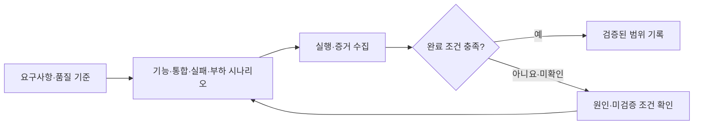

# 검증 계획

기능별 요구사항을 검증 시나리오·부하 시험·완료 증거로 연결한다. 각 문서는 검증 계획을 정의하며, 실제 실행 결과는 별도로 기록한다.

정상 흐름뿐 아니라 실패·취소·자원 상한과 부하 영향을 검증한다. 실행 환경과 증거 범위를 명시하고, 미검증 항목을 통과로 처리하지 않는다.

## 기능별 문서

| 기능 | 상세 범위 |
| --- | --- |
| [품질 기준·기능 추적](quality-and-acceptance.md) | NFR 목표와 FR별 담당 기능·테스트 연결 |
| [검증 시나리오](test-catalog.md) | 구현 후 실행할 T-01~T-45 |
| [부하·검증 증거](load-and-evidence.md) | 검증 계층, 비교 실험과 결과 기록 |

외부 기술 자료는 [공통 기술 평가 기준](../_rules/technology-evaluation.md)에 따라 적용한다.

구현 순서와 단계별 완료 조건은 [구현 작업](../todo/implementation-plan.md)에서 관리한다.

[전체 도메인](../README.md)
