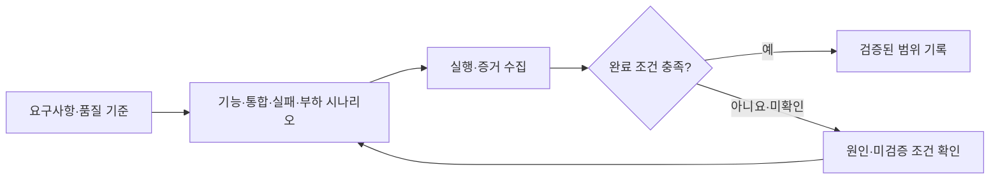

# 검증 기준

이 문서는 기능별 요구사항의 수용 조건과 변경 시 적용하는 회귀 검증 기준을 연결한다. 시나리오가 문서에 존재한다는 사실은 실행 또는 통과를 의미하지 않는다. 실제 실행 조건과 결과는 [검증 결과 양식](load-and-evidence.md)에 따라 별도로 기록해야 한다.

제품 검증의 대상은 프록시의 정책, HTTP 전달, 전환, 오류 처리와 저장 계약이다. 정상 흐름뿐 아니라 실패·취소·자원 상한과 부하의 영향을 포함해야 한다. 실행 환경과 증거 범위를 명시해야 하며, 미검증 항목을 통과로 처리해서는 안 된다.

검증 담당자는 다음 순서로 수용 여부를 판단하십시오.

1. 확인할 기능 요구사항과 기능 계약을 선택하십시오.
2. 연결된 T 시나리오와 필요한 검증 계층을 선택하십시오.
3. 실행 조건, 입력과 기대 결과를 정하십시오.
4. 시나리오를 실행하십시오.
5. 실제 응답, 실행·비교·수집 결과와 누락 증거를 기록하십시오.
6. 관측 증거를 기대 결과의 모든 조건과 대조하십시오.
7. [결과 판정 기준](load-and-evidence.md)에 따라 상태를 기록하십시오.
8. 검증한 환경·범위와 미확인 조건을 기록하십시오.

실행하지 않은 시나리오는 `not_run`이다. 실행 후 계약 위반을 확인했으면 `fail`이다. 증거가 부족하면 `inconclusive`이며, 모든 기대 결과를 확인했으면 `pass`다. 필수 증거가 미확인이면 해당 전환 gate를 통과로 표시해서는 안 된다.

```mermaid
flowchart LR
    A["요구사항·품질 기준"] --> B["기능·통합·실패·부하 시나리오"]
    B --> C["실행·증거 수집"]
    C --> D{"완료 조건 충족?"}
    D -- "예" --> E["검증된 범위 기록"]
    D -- "아니요·미확인" --> F["원인·미검증 조건 확인"]
    F --> B
```

## 기능별 문서

| 기능 | 이 문서에서 확인할 내용 |
| --- | --- |
| [품질 기준·기능 추적](quality-and-acceptance.md) | NFR 목표의 결정 항목과 FR별 담당 기능·검증 시나리오를 확인한다. |
| [검증 시나리오](test-catalog.md) | 기능 수용·회귀 검증에 사용하는 T-01~T-48의 조건과 기대 결과를 확인한다. |
| [부하·검증 증거](load-and-evidence.md) | 검증 계층의 한계, 비교 실험의 조건과 결과 판정·기록 방법을 확인한다. |

외부 기술 자료를 적용할 때는 [공통 기술 평가 기준](../_rules/technology-evaluation.md)을 따라야 한다.

기능별 코드 구성은 [구현 구성](../implementation/README.md), 제품의 전환·복귀·종료 조건은 [전환 관리](../rollout/README.md)에서 확인한다.

[전체 도메인](../README.md)
